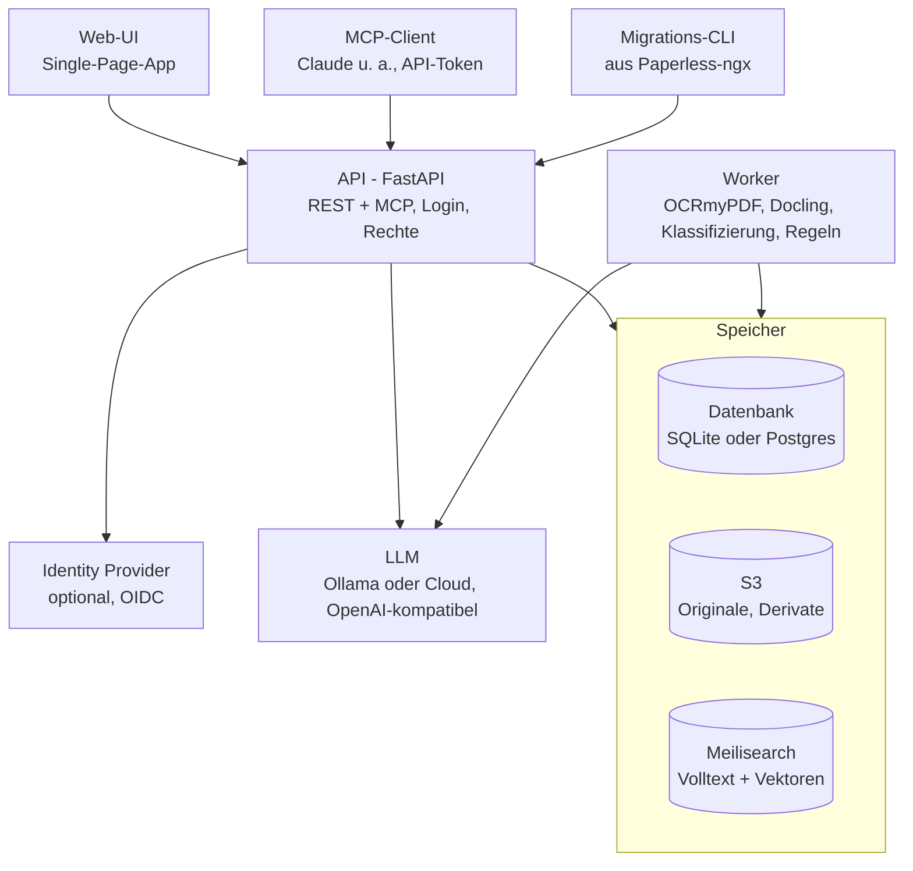

# Papiq – Architektur

Stand: 06.10.2026 · Tobias

## Ziel und Rahmen

Papiq ist ein selbst gehostetes, headless Dokumentenmanagementsystem als Ersatz für Paperless-ngx – Open Source, kostenlos, als Docker-Stack.

- Multi-User mit nativen Logins, keine Mandanten
- Headless: alle Funktionen nur über die API; Web-UI, MCP und Migrations-CLI sind Clients
- LLM lokal und in der Cloud nutzbar
- Erster Wurf mit 100 Dokumenten; Migration aus Paperless-ngx folgt als eigener Client

**Name:** Papiq, Eigenschreibweise **p:api:q** (Logo, Oberfläche). Technischer Name für Repository, Pakete, Images und Hostnamen: `papiq`.

**Logo-Konzept:** Wortmarke p:a~~p~~i:q mit grafisch durchgestrichenem mittlerem p. Ein Wort, vier Lesarten: **PAP**(er), p**API**q, pa~~p~~**I** (AI), pap**IQ**; das durchgestrichene p verweist zugleich auf „paperless“. Das Durchstreichen gibt es nur im Logo, nicht im Fließtext.

## Gesamtarchitektur

Papiq läuft als Docker-Stack aus API, Worker, Web-UI und drei Speichern; LLM und Identity Provider sind extern.

Web-UI, MCP-Client und Migrations-CLI greifen ausschließlich über die API zu. Der Worker verarbeitet Dokumente als Jobs im Hintergrund und nutzt dieselben Speicher; API und Worker teilen ein Image.

## Architekturprinzip: Ports und Adapter

Papiq ist hexagonal aufgebaut: Der fachliche Kern kennt keine Datenbank, kein S3, keinen Suchdienst und kein LLM – nur Schnittstellen (Ports), die er selbst definiert. Jede Technik steckt in einem austauschbaren Adapter.

- **Kern:** Dokumente, Schubladen, Rechte, Regeln, Lanes, Pipeline-Ablauf. Reines Python, keine Framework-Abhängigkeiten.
- **Ports:** Python-Protocols, vom Kern definiert.
- **Adapter:** implementieren die Ports; welcher Adapter läuft, entscheidet die Konfiguration an einer zentralen Stelle beim Start.
- **Tests:** Jeder Port hat In-Memory-Adapter für Kern-Tests und eine Vertragstest-Suite, die jeder echte Adapter bestehen muss.

**Eingehende Adapter (rufen den Kern auf):** REST-API (FastAPI), MCP-Server, Worker (führt Jobs aus), Migrations-CLI.

**Ausgehende Ports (der Kern ruft auf):**

| Port | Adapter im ersten Wurf | Austauschbar gegen (Beispiele) |
| --- | --- | --- |
| Repository (Metadaten) | SQLAlchemy: SQLite, Postgres | andere Datenbank |
| Objektspeicher | S3 | lokales Dateisystem (Entwicklung, Tests) |
| Suchindex | Meilisearch | Typesense, Postgres-Volltext |
| LLM | OpenAI-kompatible API | Anbieter-spezifische API |
| Embeddings | OpenAI-kompatible API | lokales Modell |
| OCR | OCRmyPDF | entfernter OCR-Dienst |
| Parser | Docling | anderer Parser |
| Job-Queue | Job-Tabelle in der Datenbank | Valkey/Redis-basierte Queue |
| Event-Bus | Outbox-Tabelle in der Datenbank, Verteilung im Prozess | Valkey Streams, NATS |
| Identität | nativer Login, OIDC | weitere Anbieter |

Webhook-Versand ist ein ausgehender Adapter, der Ereignisse vom Event-Bus abonniert.

Hexagonal betrifft den inneren Aufbau, nicht die Zahl der Container: Ein Adapter kann lokal laufen oder einen entfernten Dienst ansprechen, ohne dass sich der Kern ändert.

## Technologie-Stack

Backend und Worker in Python; ein Image, zwei Startbefehle.

| Bereich | Wahl | Status |
| --- | --- | --- |
| API | FastAPI, Pydantic | entschieden |
| Nebenläufigkeit | durchgängig async (FastAPI, SQLAlchemy async mit asyncpg bzw. aiosqlite) | entschieden |
| Ereignisse | Transactional Outbox in der Datenbank; kein Broker zum Start | entschieden |
| Datenzugriff | SQLAlchemy 2, Alembic | entschieden |
| Datenbank | SQLite oder Postgres, per Konfiguration | entschieden |
| Objektspeicher | S3-kompatibel (z. B. Garage, SeaweedFS) | Server offen |
| Suche | Meilisearch Community Edition (MIT) | entschieden |
| OCR | OCRmyPDF | entschieden |
| Parsing | Docling | entschieden |
| LLM | OpenAI-kompatible Schnittstelle (Ollama, Cloud) | entschieden |
| Jobs | eigene Job-Tabelle über SQLAlchemy | entschieden |
| Authentifizierung | Argon2id, TOTP, Authlib (OIDC) | entschieden |
| Web-UI | SvelteKit (Svelte 5), Tailwind, shadcn-svelte | Vorschlag |

Nicht verwendet: MySQL (gestrichen), LangGraph (kein Bedarf, siehe Ingest-Workflow), Procrastinate (nur Postgres).

## Datenhaltung

Drei Speicher mit klarer Aufgabe: Datenbank für Metadaten, S3 für Dateien, Meilisearch für die Suche.

**Datenbank (SQLite oder Postgres)**

- Enthält Metadaten, Stammdaten, Regeln, Jobs und Verarbeitungsprotokoll.
- SQLite nur auf lokalem Volume im WAL-Modus, nie auf Netzlaufwerk oder S3.
- Tests in CI gegen beide Datenbanken.

**S3**

- Originale unveränderlich, Objekt-Key = SHA-256 des Inhalts; Dubletten werden darüber erkannt.
- Daneben die Derivate: Archiv-PDF mit Textlayer, Docling-Ausgabe (Markdown/JSON), Vorschaubilder.

**Suche (Meilisearch)**

- Hybride Suche: Volltext und Vektoren in einem Aufruf.
- Index ist abgeleitet und jederzeit aus Datenbank und S3 neu aufbaubar; Aktualisierung per Job, daher kurz verzögert.
- Nur die API spricht mit Meilisearch; jede Suche wird auf die Schubladen gefiltert, die der Nutzer sehen darf.
- Deutsche Komposita werden zerlegt; Stemming nach Kenntnisstand nicht vorhanden, die semantische Suche fängt das ab ([Quelle](https://www.meilisearch.com/docs/resources/internals/typo_tolerance.md)).

## Datenmodell

Angelehnt an Paperless-ngx, ohne Speicherpfade, mit Schubladen als Ablage- und Rechte-Einheit.

| Begriff | Bedeutung | Regeln |
| --- | --- | --- |
| Dokument | Datei mit Metadaten | Besitzer, genau eine Schublade, ein Kontakt, ein Typ, Hash, Dokumentdatum |
| Kontakt | Gegenseite des Dokuments (Paperless: Korrespondent) | genau einer pro Dokument; global, ohne Besitzer |
| Dokumenttyp | Art des Dokuments | global; bringt zugeordnete Attribute mit |
| Tag | Klassifizierung | beliebig viele pro Dokument; global; trägt keine Rechte |
| Attribut | frei definierbares Feld (Paperless: Custom Field) | Geltungsbereich global oder je Dokumenttyp; fester Datentyp |
| Schublade | Ablage- und Rechte-Einheit | hat einen Besitzer; teilbar; jeder Nutzer hat eine private Standardschublade |

- Stammdaten (Kontakte, Typen, Tags, Attribute) pflegen nur Admins.
- Attribut-Datentypen (Vorschlag): Text, Zahl, Betrag, Datum, Ja/Nein, Auswahl, Link.

## Berechtigungen

Rechte hängen an der Schublade, nie am einzelnen Dokument.

- **Rollen:** Admin (Nutzer, Stammdaten, Regeln) und Nutzer.
- **Besitzer** eines Dokuments hat Lese- und Schreibrecht.
- **Andere Nutzer** sehen ein Dokument nur über eine Schublade, die mit ihnen geteilt ist – mit „lesen“ oder „lesen/schreiben“.
- **Teilen nach Kontakt und Typ** wird als Ablageregel umgesetzt: „Kontakt X + Typ Y → Schublade Z“. Sichtbarkeit bleibt eine explizite Zuordnung und ändert sich nicht still durch eine Fehlklassifizierung.
- **Posteingang:** Dokumente in Gelb oder Rot sieht nur der Besitzer, bis sie gelöst sind.
- **Stammdaten** sind global sichtbar – Kontaktnamen sehen alle Nutzer (bewusst akzeptiert).

## Authentifizierung

Native Logins sind der Standard; ein externer Identity Provider ist optional.

| Zugang | Verfahren |
| --- | --- |
| Web-UI | Benutzername + Passwort (Argon2id), 2FA per TOTP optional pro Nutzer; Session-Cookie (HTTP-only) |
| Web-UI mit IdP | OIDC-Login (Authlib), verknüpft mit dem lokalen Konto |
| CLI, lokaler MCP-Client | persönliche API-Tokens mit Stufen: lesen / lesen + schreiben |
| MCP von außen (später) | OAuth: die API gibt Tokens aus; Transport (HTTP, Bearer-Token) und Prüfung bleiben gleich |

## Ingest-Workflow

Jedes Dokument durchläuft feste Schritte, jeder Schritt ist einzeln wiederholbar, und das Ergebnis landet in einer von drei Lanes.

**Drei Ebenen**

1. Technische Pipeline, fest im Code: Empfangen (Hash, Dublette, S3) → OCR → Parsen.
2. Fachliche Verarbeitung, konfigurierbar: Klassifizieren → Attribute je Dokumenttyp extrahieren → Regeln anwenden.
3. Mensch im Ablauf: Posteingang für alles, was nicht grün ist.

**Zustandsautomat**

- Jedes Dokument hat einen Status, jeder Schritt ist ein Job mit Retry.
- Jeder Schritt liefert *ok*, *unsicher (mit Grund)* oder *fehlgeschlagen*.
- Protokoll pro Schritt: Eingabe, Ergebnis, Konfidenz, Grund, Modell- und Pipeline-Version, Dauer.
- In der UI: „Schritt wiederholen“ und „ab Schritt X neu verarbeiten“ (z. B. nach Modellwechsel).

**Lanes**

| Lane | Bedeutung | Auslöser |
| --- | --- | --- |
| Grün | sauber durchgelaufen | alle Schritte ok, alle Prüfungen bestanden |
| Gelb | Mensch muss bestätigen | geringe Konfidenz oder neue Gegebenheit |
| Rot | Mensch muss eingreifen | technischer Fehler nach allen Retries, oder nichts erkannt |

Die Lane eines Dokuments ist das schlechteste Ergebnis aller Schritte. Gelbe und rote Dokumente bleiben im Posteingang des Besitzers, bis sie gelöst sind.

**Konfidenz aus prüfbaren Fakten statt LLM-Selbsteinschätzung**

- Kontakt: Abgleich gegen bestehende Kontakte; kein Treffer → neuer Kontakt → Gelb.
- Dokumenttyp: LLM wählt nur aus der bestehenden Liste; Vorschlag eines neuen Typs → Gelb.
- Attribute, Datum, Betrag: Wert muss im Dokumenttext vorkommen und gültig sein; sonst Gelb.
- Regelkonflikt (zwei Regeln, verschiedene Schubladen) → Gelb.

LangGraph wird nicht eingesetzt: Die Verzweigung je Dokumenttyp ist deterministisch, Regeln müssen in der UI änderbar sein. Der Klassifizierungsschritt bleibt austauschbar, falls er später agentisch werden soll.

## Regel-Engine

Regeln sind Daten in der Datenbank, keine Code-Änderung; sie werden in der Web-UI gepflegt.

**Besitz und Wirkungsbereich**

| Art | Angelegt von | Wirkt auf | Erlaubte Aktionen |
| --- | --- | --- | --- |
| Globale Regel | Admin | alle Dokumente | Tags, Attribute, Prüfung erzwingen – nichts, was Sichtbarkeit ändert |
| Nutzer-Regel | jeder Nutzer | nur eigene Dokumente | alle Aktionen; Schublade nur, wenn der Nutzer dort schreiben darf |

**Aufbau einer Regel**

| Teil | Inhalt |
| --- | --- |
| Auslöser | Eingang eines Dokuments, jede Dokumentänderung |
| Bedingungen | Baum aus UND/ODER-Gruppen; jede Bedingung = Feld + Operator + Wert |
| Felder | Kontakt, Dokumenttyp, Tags, Quelle, Text, Attribute, Dokumentdatum |
| Operatoren (je nach Datentyp) | ist, ist eines von, enthält, Muster (Regex), größer/kleiner, vorhanden/fehlt |
| Aktionen | Schublade setzen, Kontakt setzen, Typ setzen, Tags hinzufügen/entfernen, Attribut setzen, Prüfung erzwingen (→ Posteingang) |

Gespeichert als JSON, geprüft mit Pydantic; die UI bietet einen Baukasten.

**Auswertung**

- **Position:** Regeln laufen nach der LLM-Klassifizierung und sehen deren Ergebnis.
- **Reihenfolge:** Alle zutreffenden Regeln laufen, sortiert nach Priorität; Tags werden vereinigt.
- **Konflikte → Gelb:** Setzen zwei Regeln unterschiedliche Werte für ein Einzelfeld (Schublade, Kontakt, Typ, Attribut), oder widerspricht eine Regel dem LLM-Ergebnis, geht das Dokument auf Gelb. Regeln überschreiben das LLM nicht stillschweigend.
- **Schleifenschutz:** Regeln laufen pro Änderung einmal; eine Regel-Aktion löst keine weiteren Regeln aus.
- **Probelauf:** Vor dem Speichern einer Dokumentänderung zeigt die UI die Folgen, z. B. „Dokument wandert in Schublade Z – sichtbar für User B“.
- **Nachvollziehbarkeit:** Regeln sind versioniert; das Verarbeitungsprotokoll hält fest, welche Regel in welcher Version was geändert hat.

**Rückwirkendes Anwenden (erster Wurf)**

Regeln wirken nicht automatisch auf bestehende Dokumente. Anlegen oder Ändern einer Regel betrifft nur künftige Eingänge und Änderungen.

Rückwirkend nur auf ausdrücklichen Wunsch: Button „Auf bestehende Dokumente anwenden" an der Regel. Ein Auswahldialog listet die betroffenen Dokumente mit den jeweiligen Änderungen; der Nutzer wählt aus, was angewendet wird. Dokumente, bei denen die Regel einen Konflikt erzeugt, sind markiert; wählt der Nutzer sie trotzdem aus, gilt das als bewusste Entscheidung und der Regelwert wird ohne Umweg über Gelb übernommen. Die Ausführung läuft als Hintergrund-Job.

## Asynchronität und Ereignisse

Kein API-Aufruf wartet auf OCR, Parsing oder LLM: Die API nimmt an, quittiert sofort, die Verarbeitung läuft im Hintergrund, und jede Zustandsänderung wird als Ereignis verteilt.

**Ablauf**

1. `POST /documents`: Original nach S3, dann Dokument und Ereignis `document.received` in einer Transaktion; Antwort `202 Accepted` mit Dokument-ID.
2. Der Worker verarbeitet Schritt für Schritt; jeder Schritt schreibt Ergebnis und Ereignis in einer Transaktion.
3. Ein Verteiler liest die Outbox und stellt zu: Web-UI (Server-Sent Events), Webhooks, Suchindex.

**Transactional Outbox**

- Zustand und Ereignis landen in derselben Datenbank-Transaktion; kein Ereignis geht verloren, wenn die Zustellung abbricht.
- Zustellung mindestens einmal; Empfänger erkennen Wiederholungen an der Ereignis-ID.
- SQLite: Outbox wird abgefragt (Polling). Postgres: optional `LISTEN/NOTIFY` als Optimierung im Adapter.
- Ein Broker (Valkey Streams, NATS) wird erst als weiterer Adapter nötig, z. B. bei mehreren API-Instanzen.

**Ereignisse (erster Wurf)**

`document.received`, `document.step_completed`, `document.lane_changed`, `document.filed`, `document.updated`, `document.deleted`. Weitere Typen kommen bei Bedarf hinzu; Empfänger ignorieren unbekannte Typen.

**Webhooks (Egress)**

- Webhooks melden Ereignisse an externe Systeme. Eingehende Daten (Ingress) laufen über die normale REST-API mit API-Token, z. B. `POST /documents`.
- Jeder Nutzer legt eigene Webhooks an; sie melden nur Ereignisse zu Dokumenten, die dieser Nutzer sehen darf.
- Schlanke Ereignisse: nur Ereignistyp, Zeitpunkt, Ereignis-ID und Dokument-ID. Details holt der Empfänger per API mit eigenem Token; dabei greifen die Schubladen-Rechte.
- Abonnement: Ziel-URL, Ereignistypen, Geheimnis.
- Zustellung signiert (HMAC-SHA256), Wiederholung mit wachsendem Abstand, Zustellprotokoll in der UI.

**Nebenläufigkeit im Code**

Durchgängig `async`: FastAPI, SQLAlchemy async (asyncpg bzw. aiosqlite), HTTP-Clients. Rechenlastige Schritte (OCR, Docling) laufen in eigenen Prozessen, damit sie die Event-Loop nicht blockieren.

## Schnittstellen

Die REST-API ist der einzige Zugang; es gibt keine Hintertüren für UI oder Migration.

- **REST-API:** OpenAPI-Spezifikation als Vertrag; daraus wird der TypeScript-Client der Web-UI generiert.
- **MCP-Server:** im API-Prozess, nutzt dieselbe Service-Schicht; HTTP mit Bearer-Token. Tools (Vorschlag): `search`, `get_document`, `get_text`, `update_metadata`, `list_tags`.
- **Web-UI:** eigener Container, Single-Page-App auf der API; Job-Fortschritt per Server-Sent Events; PDF-Anzeige mit PDF.js; Posteingang mit Lanes, Probelauf für Regeln.

## Migration aus Paperless-ngx

Ein eigener CLI-Client liest die Paperless-REST-API und schreibt über die Papiq-API – damit beweist er zugleich, dass die API vollständig ist. Umsetzung nach dem ersten Wurf.

| Paperless-ngx | Papiq | Hinweis |
| --- | --- | --- |
| Korrespondent | Kontakt | 1:1 |
| Dokumenttyp | Dokumenttyp | 1:1 |
| Tag | Tag | 1:1 |
| Custom Field | Attribut | Geltungsbereich bei Migration festlegen |
| Besitzer | Besitzer | 1:1 |
| Speicherpfad | – | entfällt; Abbildung auf Schubladen offen |
| Berechtigungen pro Dokument | Schublade | Abbildung offen |

## Offene Punkte

- [ ] Web-UI-Framework festlegen (Vorschlag: SvelteKit)
- [ ] S3-Server wählen (Garage oder SeaweedFS; aktuellen Status von MinIO prüfen)
- [ ] Backup-Strategie für SQLite und Postgres
- [ ] Konfidenz-Schwellen und Anzahl automatischer Retries festlegen
- [ ] Attribut-Datentypen bestätigen
- [ ] Embedding-Modell für die semantische Suche wählen (lokal oder Cloud)
- [ ] Migration: Paperless-Speicherpfade und -Berechtigungen auf Schubladen abbilden
- [ ] Verfügbarkeit des Namens „Papiq“ prüfen (GitHub, PyPI, Docker Hub, Marken)
