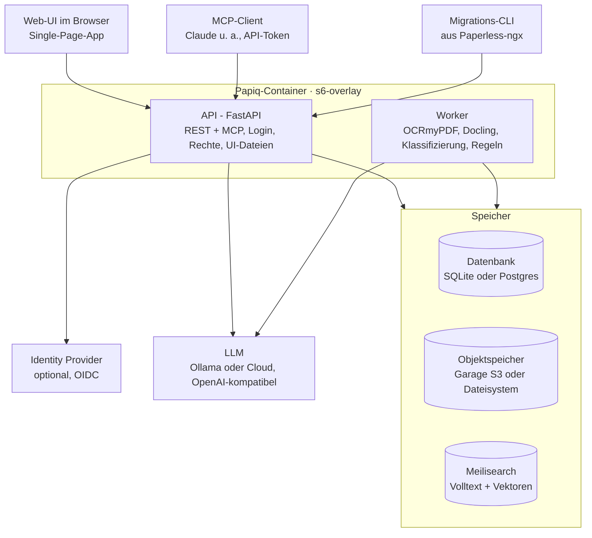

# Papiq – Architektur

Stand: 06.10.2026 · Tobias

## Ziel und Rahmen

Papiq ist ein selbst gehostetes, headless Dokumentenmanagementsystem als Ersatz für Paperless-ngx – Open Source, kostenlos, als Docker-Stack.

- Multi-User mit nativen Logins, keine Mandanten
- Headless: alle Funktionen nur über die API; Web-UI, MCP und Migrations-CLI sind Clients
- LLM lokal und in der Cloud nutzbar
- Erster Wurf mit 100 Dokumenten; Migration aus Paperless-ngx folgt als eigener Client

**Name:** Papiq, Eigenschreibweise **p:api:q** (Logo, Oberfläche). Technischer Name für Repository, Pakete, Images und Hostnamen: `papiq`.

**Logo-Konzept:** Wortmarke p:a~~p~~i:q mit grafisch durchgestrichenem mittlerem p. Ein Wort, vier Lesarten: **PAP**(er), p**API**q, pa~~p~~**I** (AI), pap**IQ**; das durchgestrichene p verweist zugleich auf „paperless“. Das Durchstreichen gibt es nur im Logo, nicht im Fließtext.

## Gesamtarchitektur

Papiq läuft als ein Docker-Container (API, Worker, Auslieferung der Web-UI, überwacht von s6-overlay) neben drei Speichern; LLM und Identity Provider sind extern.

Web-UI, MCP-Client und Migrations-CLI greifen ausschließlich über die API zu. Der Worker verarbeitet Dokumente als Jobs im Hintergrund und nutzt dieselben Speicher. API und Worker laufen als überwachte Dienste im selben Container (siehe Betrieb).

## Architekturprinzip: Ports und Adapter

Papiq ist hexagonal aufgebaut: Der fachliche Kern kennt keine Datenbank, kein S3, keinen Suchdienst und kein LLM – nur Schnittstellen (Ports), die er selbst definiert. Jede Technik steckt in einem austauschbaren Adapter.

- **Kern:** Dokumente, Schubladen, Rechte, Regeln, Lanes, Pipeline-Ablauf. Reines Python, keine Framework-Abhängigkeiten.
- **Ports:** Python-Protocols, vom Kern definiert.
- **Adapter:** implementieren die Ports; welcher Adapter läuft, entscheidet die Konfiguration an einer zentralen Stelle beim Start.
- **Tests:** Jeder Port hat In-Memory-Adapter für Kern-Tests und eine Vertragstest-Suite, die jeder echte Adapter bestehen muss.

**Eingehende Adapter (rufen den Kern auf):** REST-API (FastAPI), MCP-Server, Worker (führt Jobs aus), Migrations-CLI.

**Ausgehende Ports (der Kern ruft auf):**

| Port | Adapter im ersten Wurf | Austauschbar gegen (Beispiele) |
| --- | --- | --- |
| Repository (Metadaten) | SQLAlchemy: SQLite, Postgres | andere Datenbank |
| Objektspeicher | S3 (Garage), lokales Dateisystem – gleichwertig, per Konfiguration | anderer S3-Server (z. B. SeaweedFS) |
| Suchindex | Meilisearch | Typesense, Postgres-Volltext |
| LLM | OpenAI-kompatible API | Anbieter-spezifische API |
| Embeddings | OpenAI-kompatible API | lokales Modell |
| OCR | OCRmyPDF | entfernter OCR-Dienst |
| Parser | Docling | anderer Parser |
| Job-Queue | Job-Tabelle in der Datenbank | Valkey/Redis-basierte Queue |
| Event-Bus | Outbox-Tabelle in der Datenbank, Verteilung im Prozess | Valkey Streams, NATS |
| Identität | nativer Login, OIDC | weitere Anbieter |
| Vorschau | PDFium (erste Seite als WebP) | anderer Renderer |
| Mustersuche (Regeln) | `regex` mit Zeitlimit | eigener Dienst |
| Webhook-Versand | httpx2 | andere HTTP-Bibliothek |
| Uhr | Systemuhr | feste Uhr in Tests |
| Passwort-Hash, Geheimnis-Verschlüsselung, TOTP | Argon2id, AES-GCM, pyotp | andere Verfahren |

Webhook-Versand ist ein ausgehender Adapter, der Ereignisse vom Event-Bus abonniert. Jeder Port
hat einen In-Memory-Adapter für die Kern-Tests (M13-Review: der Mustersuche fehlt er noch, der
Speicher-Container nutzt den `regex`-Adapter, der ohne Dienst läuft).

Hexagonal betrifft den inneren Aufbau, nicht die Zahl der Container: Ein Adapter kann lokal laufen oder einen entfernten Dienst ansprechen, ohne dass sich der Kern ändert.

## Technologie-Stack

Backend und Worker in Python; ein Container mit s6-overlay als Prozessüberwachung.

| Bereich | Wahl | Status |
| --- | --- | --- |
| API | FastAPI, Pydantic | entschieden |
| Nebenläufigkeit | durchgängig async (FastAPI, SQLAlchemy async mit asyncpg bzw. aiosqlite) | entschieden |
| Ereignisse | Transactional Outbox in der Datenbank; kein Broker zum Start | entschieden |
| Datenzugriff | SQLAlchemy 2, Alembic | entschieden |
| Datenbank | SQLite oder Postgres, per Konfiguration | entschieden |
| Objektspeicher | Garage (S3) oder lokales Dateisystem, per Konfiguration | entschieden |
| Suche | Meilisearch Community Edition (MIT) | entschieden |
| OCR | OCRmyPDF | entschieden |
| Parsing | Docling | entschieden |
| LLM | OpenAI-kompatible Schnittstelle (Ollama, Cloud) | entschieden |
| LLM-Modell (lokal) | `qwen3:8b` über Ollama mit 8192 Token Kontext (NUC, nur CPU); Bewertung siehe unten | entschieden |
| Embedding-Modell (lokal) | `snowflake-arctic-embed2` über Ollama, Anfragen mit dem Präfix `query: `; Bewertung unter „Suche“ | entschieden |
| Jobs | eigene Job-Tabelle über SQLAlchemy | entschieden |
| Authentifizierung | Argon2id, TOTP, Authlib (OIDC) | entschieden |
| Web-UI | SvelteKit (Svelte 5), Tailwind, shadcn-svelte; Ziel: cleanes, modernes Interface | entschieden |
| Container | ein Papiq-Image, Prozessüberwachung mit s6-overlay | entschieden |

Nicht verwendet: MySQL (gestrichen), LangGraph (kein Bedarf, siehe Ingest-Workflow), Procrastinate (nur Postgres).

## Datenhaltung

Drei Speicher mit klarer Aufgabe: Datenbank für Metadaten, Objektspeicher für Dateien, Meilisearch für die Suche.

**Datenbank (SQLite oder Postgres)**

- Enthält Metadaten, Stammdaten, Regeln, Jobs und Verarbeitungsprotokoll.
- SQLite nur auf lokalem Volume im WAL-Modus, nie auf Netzlaufwerk oder S3.
- Tests in CI gegen beide Datenbanken.

**Objektspeicher (S3 oder Dateisystem)**

- Zwei gleichwertige Adapter: S3 (erster Server: Garage) oder lokales Dateisystem.
- Papiq nutzt keine Speicher-Events. Ereignisse entstehen ausschließlich in der Outbox; so bleibt der Adapter frei tauschbar (Garage und Dateisystem kennen keine Events).
- Originale unveränderlich, Objekt-Key = SHA-256 des Inhalts; Dubletten werden darüber erkannt. Eine Datei, die derselbe Besitzer schon hat, wird abgelehnt; ein anderer Nutzer bekommt ein eigenes Dokument zum selben Objekt.
- Daneben die Derivate: Archiv-PDF mit Textlayer, Docling-Ausgabe (Markdown/JSON), Vorschaubilder.

**Suche (Meilisearch)**

- Hybride Suche: Volltext und Vektoren in einem Aufruf.
- Index ist abgeleitet und jederzeit aus Datenbank und S3 neu aufbaubar; Aktualisierung per Job, daher kurz verzögert.
- Nur API und Worker sprechen mit Meilisearch: der Worker schreibt den Index (Jobs, Abgleich, Neuaufbau), die API sucht; jede Suche wird auf die Reichweite des Nutzers gefiltert (Admins mit `all_users`: alle Dokumente).
- Deutsche Komposita werden zerlegt; Stemming nach Kenntnisstand nicht vorhanden, die semantische Suche fängt das ab ([Quelle](https://www.meilisearch.com/docs/resources/internals/typo_tolerance.md)).

## Datenmodell

Angelehnt an Paperless-ngx, ohne Speicherpfade, mit Schubladen als Ablage- und Rechte-Einheit.

| Begriff | Bedeutung | Regeln |
| --- | --- | --- |
| Dokument | Datei mit Metadaten | Besitzer, genau eine Schublade, höchstens ein Kontakt, höchstens ein Typ, Hash, Dokumentdatum |
| Kontakt | Gegenseite des Dokuments (Paperless: Korrespondent) | höchstens einer pro Dokument (leer, bis die Klassifizierung oder eine Person einen setzt); global, ohne Besitzer |
| Dokumenttyp | Art des Dokuments | global; bringt zugeordnete Felder mit |
| Tag | Klassifizierung | beliebig viele pro Dokument; global; trägt keine Rechte |
| Feld | frei definierbares Feld (Paperless: Custom Field) | Geltungsbereich global oder je Dokumenttyp; fester Datentyp |
| Schublade | Ablage- und Rechte-Einheit | hat einen Besitzer; teilbar; jeder Nutzer hat eine private Standardschublade (nicht teilbar, nicht löschbar) |

- Stammdaten (Kontakte, Typen, Tags, Felder) pflegen nur Admins. Ausnahme: Wählt eine Person in der Prüfansicht einen Kontakt für ein offenes Kontaktfeld, lernt der Kontakt den vom Modell gelesenen Namen als Alias, gleich welche Rolle sie hat (Tobi, 10.10.2026).
- Felddatentypen: Text, Zahl, Betrag (Dezimalzahl mit ISO-4217-Währung je Wert), Datum, Ja/Nein, Auswahl (eine Option aus fester Liste), Link (absolute http(s)-URL).

## Berechtigungen

Rechte hängen an der Schublade, nie am einzelnen Dokument.

- **Rollen:** Admin und Nutzer. Admins haben alle Rechte und sehen alles (Tobi, 08.10.2026): Sie lesen und ändern alle Dokumente (auch fremde in Gelb, Rot und in Verarbeitung), lesen das Verarbeitungsprotokoll, wiederholen, verarbeiten neu, bestätigen und löschen; sie sehen und verwalten alle Schubladen (umbenennen, Freigaben, löschen) und legen in jede ab; sie lesen und ändern alle Regeln und Webhooks; dazu Nutzer und Stammdaten. Ein deaktivierter Admin hat keine Rechte.
- **Reichweite:** eigene Dokumente und grüne Dokumente in eigenen oder freigegebenen Schubladen. Listen, Posteingang und Suche zeigen die Reichweite; Admins schalten auf alle Nutzer um (`all_users`). Webhooks melden nur Dokumente in der Reichweite ihres Besitzers, auch bei Admins; SSE erhalten Admins zu allen Dokumenten.
- **Besitzer** eines Dokuments hat Lese- und Schreibrecht.
- **Andere Nutzer** sehen ein Dokument nur über eine Schublade, die mit ihnen geteilt ist – mit „lesen“ oder „lesen/schreiben“.
- **Teilen nach Kontakt und Typ** wird als Ablageregel umgesetzt: „Kontakt X + Typ Y → Schublade Z“. Sichtbarkeit bleibt eine explizite Zuordnung und ändert sich nicht still durch eine Fehlklassifizierung.
- **Posteingang:** Dokumente in Gelb oder Rot sieht nur der Besitzer (und Admins), bis sie gelöst sind. Bestätigt ein Admin, legt er in jede Schublade ab; die Ablage prüft sonst, ob der Besitzer in die Schublade schreiben darf.
- **Verschieben** in eine andere Schublade: der Besitzer (nur in Schubladen, in denen er schreiben darf) oder ein Admin (jedes Dokument in jede Schublade). Eine Freigabe erlaubt kein Verschieben.
- **Stammdaten** sind global sichtbar – Kontaktnamen sehen alle Nutzer (bewusst akzeptiert).

## Authentifizierung

Native Logins sind der Standard; ein externer Identity Provider ist optional.

| Zugang | Verfahren |
| --- | --- |
| Web-UI | Benutzername + Passwort (Argon2id), 2FA per TOTP optional pro Nutzer; Session-Cookie (HTTP-only) |
| Web-UI mit IdP | OIDC-Login (Authlib), verknüpft mit dem lokalen Konto |
| CLI, lokaler MCP-Client | persönliche API-Tokens mit Stufen: lesen / lesen + schreiben |
| MCP von außen (später) | OAuth: die API gibt Tokens aus; Transport (HTTP, Bearer-Token) und Prüfung bleiben gleich |

## Ingest-Workflow

Jedes Dokument durchläuft feste Schritte, jeder Schritt ist einzeln wiederholbar, und das Ergebnis landet in einer von drei Lanes.

**Drei Ebenen**

1. Technische Pipeline, fest im Code: Empfangen (Hash, Dublette, S3) → OCR → Parsen.
2. Fachliche Verarbeitung, konfigurierbar: Klassifizieren → Felder je Dokumenttyp extrahieren → Regeln anwenden.
3. Mensch im Ablauf: Posteingang für alles, was nicht grün ist.

**Zustandsautomat**

- Jedes Dokument hat einen Status, jeder Schritt ist ein Job mit Retry.
- Jeder Schritt liefert *ok*, *unsicher (mit Grund)* oder *fehlgeschlagen*.
- Protokoll pro Schritt: Eingabe, Ergebnis, Konfidenz, Grund, Modell- und Pipeline-Version, Dauer.
- In der UI: „Schritt wiederholen“ und „ab Schritt X neu verarbeiten“ (z. B. nach Modellwechsel).

**Lanes**

| Lane | Bedeutung | Auslöser |
| --- | --- | --- |
| Grün | sauber durchgelaufen | alle Schritte ok, alle Prüfungen bestanden |
| Gelb | Mensch muss bestätigen | geringe Konfidenz oder neue Gegebenheit |
| Rot | Mensch muss eingreifen | technischer Fehler nach allen Retries, oder nichts erkannt |

Die Lane eines Dokuments ist das schlechteste Ergebnis aller Schritte. Solange die Pipeline läuft, hat ein Dokument keine Lane; andere Nutzer sehen es erst, wenn es grün ist. Gelbe und rote Dokumente bleiben im Posteingang des Besitzers, bis sie gelöst sind.

**Konfidenz aus prüfbaren Fakten statt LLM-Selbsteinschätzung**

- Kontakt: Abgleich gegen bestehende Kontakte, ihre Namen und Aliase; kein Treffer → neuer Kontakt → Gelb. Grün nur, wenn Name oder ein Alias des Kontakts im Text steht. Das Modell sieht eine Vorauswahl von höchstens 20 Kontakten (mit Aliasen), deren Namen der Text am stärksten zeigt (ganzer Name, sonst Anteil der Wörter), und nennt einen davon oder den Namen wie im Dokument.
- Aliase (Tobi, 10.10.2026): weitere Namen eines Kontakts („Nord Krankenversicherung AG“ für „Nord Versicherungsgruppe“), über alle Kontakte eindeutig zusammen mit den Namen. Wählt die Person in der Prüfansicht einen bestehenden Kontakt (eingegeben oder Vorschlag angenommen), wird der gelesene Name dessen Alias, sofern er mit Name oder Alias des Kontakts ein Wort (ab drei Buchstaben) teilt oder so ähnlich ist wie ein Kontaktvorschlag (Empfängernamen sollen kein Alias werden); war er Alias eines anderen Kontakts, wandert er. Ein Alias darf nicht wie der Name oder Alias eines anderen Kontakts verglichen werden (Rechtsform und Satzzeichen zählen nicht). Aliase stehen auf einer Zeile (höchstens 100 je Kontakt, gelernte höchstens 100 Zeichen); die Listen im Prompt gelten wie der Text als Daten. Kein maschinelles Lernen wie in Paperless; keine Aliase für Tags; Paperless-Match-Regeln werden bei der Migration nicht übernommen.
- Dokumenttyp: LLM wählt nur aus der bestehenden Liste; Vorschlag eines neuen Typs → Gelb. Je Typ kann eine Beschreibung (höchstens 300 Zeichen) sagen, was dazugehört; sie steht in der Nachricht vor dem Dokument, nicht im System-Prompt.
- Felder, Datum, Betrag: Wert muss im Dokumenttext vorkommen und gültig sein; sonst Gelb. Ein Datumsfeld gleich dem Dokumentdatum ist nur ein Vorschlag (Gelb), weil Modelle das Dokumentdatum für fehlende Daten wie die Fälligkeit einsetzen.
- Regelkonflikt (zwei Regeln, verschiedene Schubladen) → Gelb.

**Bewertung des lokalen Modells (07.10.2026):** `qwen3:8b` mit 8192 Kontext auf dem NUC, 5 Dokumente des Bewertungssatzes: kein falsches Grün, keine Änderung ohne bestandene Prüfung, Kontakt, Typ, Datum und Beträge richtig, Anweisungen im Text ohne Wirkung. Zweimal grün mit falscher Fälligkeit (Dokumentdatum eingesetzt), daraufhin die Regel oben. Laufzeit 3 bis 10 Minuten pro Dokument (Median 190 s); empfohlen ist daher `PAPIQ_LLM_TIMEOUT=600`.

LangGraph wird nicht eingesetzt: Die Verzweigung je Dokumenttyp ist deterministisch, Regeln müssen in der UI änderbar sein. Der Klassifizierungsschritt bleibt austauschbar, falls er später agentisch werden soll.

## Suche

Hybride Suche in Meilisearch: Wörter und Bedeutung (Vektoren) in einer Anfrage, `GET /documents/search`.

- **Index folgt den Dokumenten.** Jedes Dokument-Ereignis erzeugt einen Job; er liest den aktuellen Stand aus Datenbank und Objektspeicher, schreibt ihn in den Index und prüft danach, ob sich das Dokument inzwischen geändert hat. Fehlgeschlagene Jobs wiederholen sich mit wachsendem Abstand (etwa drei Stunden insgesamt); fällt nur das Embedding aus, steht das Dokument sofort mit seinen Wörtern im Index. Der Index enthält nichts, was nicht in der Datenbank steht: Ein Abgleich (alle sechs Stunden und bei jedem Start des Workers) und ein vollständiger Neuaufbau (`POST /search/reindex`, `reindex`) stellen ihn jederzeit wieder her; der Neuaufbau läuft neben dem aktiven Index und wird getauscht.
- **Rechte.** Der Index kennt Besitzer, Schublade und Lane und filtert danach (Besitzer sieht alles, andere nur Grünes in eigenen oder geteilten Schubladen; ein Admin mit `all_users` alles); jeder Treffer wird zusätzlich gegen die Datenbank geprüft. Eine entzogene Freigabe wirkt damit sofort. Dokumente in Verarbeitung stehen im Index und sind nur für den Besitzer sichtbar.
- **Abschnitte.** Der Text wird in Abschnitte von etwa 1500 Zeichen geteilt (höchstens 8, zusammen höchstens 200 000 Zeichen im Index); jeder bekommt einen Vektor, der erste beginnt mit Titel, Kontakt, Typ und Tags. Der Text dahinter ist per Wörtern auffindbar, aber ohne Vektor.
- **Namen im Index.** Kontakt, Typ und Tags stehen als Namen im Index; eine Umbenennung stößt die betroffenen Dokumente neu an.
- **Ausfälle.** Ohne Embedding-Dienst (oder bei zu langsamer Anfrage-Einbettung) sucht Papiq nur mit Wörtern. Ein Ausfall der Suche macht `/health` `degraded`, nicht `503`.

**Bewertung der Embedding-Modelle (07.10.2026):** 28 Dokumente und 48 Anfragen des Bewertungssatzes (`backend/evaluation/search/`: Wörter, Nummern, Komposita, Tippfehler, Umschreibungen, englische Anfragen, Stellen hinter den Abschnitten), Ollama auf dem NUC, Meilisearch 1.54.3. Treffer in den ersten drei, Standardgewicht 0,5 (Wörter und Bedeutung gleich): `bge-m3` 100 %, `snowflake-arctic-embed2` 100 %, `qwen3-embedding:0.6b` 100 %; Hit@1 98 %, 100 %, 98 %. Reine Wortsuche findet nur 69 %. Bei reiner Bedeutungssuche liegt `snowflake-arctic-embed2` vorn (Hit@3 98 % gegen 92 %, bei Nummern 100 % gegen 40 % bzw. 60 %). Indexieren auf der CPU des NUC: 0,55 s (`bge-m3`), 0,58 s (`snowflake-arctic-embed2`), 1,39 s (`qwen3-embedding:0.6b`) je Abschnitt; im Schnitt 1,2 Abschnitte je Dokument. Tobi wählte `snowflake-arctic-embed2` (`PAPIQ_EMBEDDING_MODEL=snowflake-arctic-embed2`, `PAPIQ_EMBEDDING_QUERY_PREFIX=query:`, `PAPIQ_EMBEDDING_DIMENSIONS=1024`). Der Satz ist klein: Unterschiede von einer Anfrage sind keine Aussage. Die Berichte liegen in `backend/evaluation/search/reports/`. Ein Modellwechsel braucht einen Neuaufbau des Index.

## Regel-Engine

Regeln sind Daten in der Datenbank, keine Code-Änderung; sie werden in der Web-UI gepflegt.

**Besitz und Wirkungsbereich**

| Art | Angelegt von | Wirkt auf | Erlaubte Aktionen |
| --- | --- | --- | --- |
| Globale Regel | Admin | alle Dokumente | Tags, Felder, Prüfung erzwingen – nichts, was Sichtbarkeit ändert |
| Nutzer-Regel | jeder Nutzer | nur eigene Dokumente | alle Aktionen; Schublade nur, wenn der Besitzer der Regel dort schreiben darf (auch wenn ein Admin sie ändert) |

**Aufbau einer Regel**

| Teil | Inhalt |
| --- | --- |
| Auslöser | Eingang eines Dokuments, jede Dokumentänderung |
| Bedingungen | Baum aus UND/ODER-Gruppen, jede Gruppe negierbar; jede Bedingung = Feld + Operator + Wert |
| Felder | Kontakt, Dokumenttyp, Tags, Eingangskanal (Web, API, Migration; später weitere wie E-Mail), Text, Felder, Dokumentdatum |
| Operatoren (je nach Datentyp) | ist, ist eines von, enthält, Muster (Regex), größer/kleiner, vorhanden/fehlt |
| Aktionen | Schublade setzen, Kontakt setzen, Typ setzen, Titel setzen (mit Platzhaltern), Tags hinzufügen/entfernen, Feld setzen, Prüfung erzwingen (→ Posteingang) |

Gespeichert als JSON, geprüft mit Pydantic; die UI bietet einen Baukasten.

**Auswertung**

- **Position:** Regeln laufen nach der LLM-Klassifizierung und sehen deren Ergebnis.
- **Reihenfolge:** Alle zutreffenden Regeln laufen, sortiert nach Priorität; Tags werden vereinigt.
- **Konflikte → Gelb:** Setzen zwei Regeln unterschiedliche Werte für ein Einzelfeld (Schublade, Kontakt, Typ, Feld), oder widerspricht eine Regel dem LLM-Ergebnis, geht das Dokument auf Gelb. Regeln überschreiben das LLM nicht stillschweigend.
- **Schleifenschutz:** Regeln laufen pro Änderung einmal; eine Regel-Aktion löst keine weiteren Regeln aus.
- **Misstrauen (M7):** Kontakt, Typ und Tags, die das Modell gesetzt und niemand bestätigt hat, gelten als unsicher. Trifft eine Regel nur deshalb zu, legt sie nicht in eine geteilte oder fremde Schublade ab.
- **Gelb nur in der Pipeline (M7):** Konflikte und „Prüfung erzwingen" machen ein Dokument nur beim Eingang gelb. Bei einer Änderung durch eine Person bleibt es grün; nicht Anwendbares wird nur gemeldet (ein abgelegtes Dokument verschwände sonst für andere).
- **Änderungs-Regeln flankengesteuert (M7):** Eine Regel mit Auslöser Änderung wirkt nur, wenn sie nach der Änderung zutrifft und vorher nicht. Was die Person in dieser Änderung oder vorher im selben Verarbeitungslauf entschieden hat, ändert keine Regel (die Person gewinnt).
- **Probelauf:** Vor dem Speichern einer Dokumentänderung zeigt die UI die Folgen, z. B. „Dokument wandert in Schublade Z – sichtbar für User B“.
- **Nachvollziehbarkeit:** Regeln sind versioniert; das Verarbeitungsprotokoll hält fest, welche Regel in welcher Version was geändert hat.

**Sichtbarkeit (M7, M11b):** Globale Regeln lesen alle, ändern nur Admins. Nutzer-Regeln lesen und ändern ihr Besitzer und Admins (Tobi, 08.10.2026); andere Nutzer erfahren nicht, dass es sie gibt.

**Rückwirkendes Anwenden (erster Wurf)**

Regeln wirken nicht automatisch auf bestehende Dokumente. Anlegen oder Ändern einer Regel betrifft nur künftige Eingänge und Änderungen.

Rückwirkend nur auf ausdrücklichen Wunsch: Button „Auf bestehende Dokumente anwenden" an der Regel. Eine Nutzer-Regel wenden ihr Besitzer und Admins an, auf Dokumente ihres Besitzers; eine globale Regel jeder, auf die Dokumente, in die er schreiben darf (Admins: alle). Ein Auswahldialog listet die betroffenen Dokumente mit den jeweiligen Änderungen; der Nutzer wählt aus, was angewendet wird. Dokumente, bei denen die Regel einen Konflikt erzeugt, sind markiert; wählt der Nutzer sie trotzdem aus, gilt das als bewusste Entscheidung und der Regelwert wird ohne Umweg über Gelb übernommen. Die Ausführung läuft als Hintergrund-Job.

## Asynchronität und Ereignisse

Kein API-Aufruf wartet auf OCR, Parsing oder LLM: Die API nimmt an, quittiert sofort, die Verarbeitung läuft im Hintergrund, und jede Zustandsänderung wird als Ereignis verteilt.

**Ablauf**

1. `POST /documents`: Original nach S3, dann Dokument und Ereignis `document.received` in einer Transaktion; Antwort `202 Accepted` mit Dokument-ID.
2. Der Worker verarbeitet Schritt für Schritt; jeder Schritt schreibt Ergebnis und Ereignis in einer Transaktion.
3. Ein Verteiler liest die Outbox und stellt zu: Web-UI (Server-Sent Events), Webhooks, Suchindex.

**Transactional Outbox**

- Zustand und Ereignis landen in derselben Datenbank-Transaktion; kein Ereignis geht verloren, wenn die Zustellung abbricht.
- Zustellung mindestens einmal; Empfänger erkennen Wiederholungen an der Ereignis-ID.
- SQLite: Outbox wird abgefragt (Polling). Postgres: optional `LISTEN/NOTIFY` als Optimierung im Adapter.
- Ein Broker (Valkey Streams, NATS) wird erst als weiterer Adapter nötig, z. B. bei mehreren API-Instanzen.

**Ereignisse (erster Wurf)**

`document.received`, `document.step_completed`, `document.lane_changed`, `document.filed`, `document.updated`, `document.deleted`. Weitere Typen kommen bei Bedarf hinzu; Empfänger ignorieren unbekannte Typen.

**Webhooks (Egress)**

- Webhooks melden Ereignisse an externe Systeme. Eingehende Daten (Ingress) laufen über die normale REST-API mit API-Token, z. B. `POST /documents`.
- Jeder Nutzer legt eigene Webhooks an; sie melden nur Ereignisse zu Dokumenten in der Reichweite dieses Nutzers (auch bei Admins: ihre Rechte erweitern Webhooks nicht).
- Schlanke Ereignisse: nur Ereignistyp, Zeitpunkt, Ereignis-ID und Dokument-ID. Details holt der Empfänger per API mit eigenem Token; dabei greifen die Schubladen-Rechte.
- Abonnement: Ziel-URL, Ereignistypen, Geheimnis.
- Zustellung signiert (HMAC-SHA256), Wiederholung mit wachsendem Abstand, Zustellprotokoll in der UI.

**Nebenläufigkeit im Code**

Durchgängig `async`: FastAPI, SQLAlchemy async (asyncpg bzw. aiosqlite), HTTP-Clients. Rechenlastige Schritte (OCR, Docling) laufen in eigenen Prozessen, damit sie die Event-Loop nicht blockieren.

## Schnittstellen

Die REST-API ist der einzige Zugang; es gibt keine Hintertüren für UI oder Migration.

- **REST-API:** OpenAPI-Spezifikation als Vertrag; daraus wird der TypeScript-Client der Web-UI generiert.
- **MCP-Server:** im API-Prozess, nutzt dieselbe Service-Schicht; HTTP mit Bearer-Token. Tools (Vorschlag): `search`, `get_document`, `get_text`, `update_metadata`, `list_tags`.
- **Web-UI:** Single-Page-App auf der API, als statische Dateien im Papiq-Container ausgeliefert; Job-Fortschritt per Server-Sent Events; PDF-Anzeige mit PDF.js; Posteingang mit Lanes, Probelauf für Regeln.

## Betrieb: Papiq-Container mit s6-overlay

Papiq wird als ein Docker-Image ausgeliefert. Darin überwacht s6-overlay alle Papiq-Prozesse: Es läuft als PID 1, startet Dienste in fester Reihenfolge, startet abgestürzte Dienste neu und fährt sauber herunter.

**Dienste im Container**

| Dienst | Art | Aufgabe |
| --- | --- | --- |
| `init-papiq` | einmalig | Konfiguration prüfen, Verzeichnisse und Rechte für Volumes setzen (`PUID`/`PGID`) |
| `init-migrations` | einmalig | Datenbankschema per Alembic aktualisieren, bevor API und Worker starten |
| `svc-api` | dauerhaft | Uvicorn mit FastAPI: REST, MCP, SSE und Auslieferung der Web-UI (statische Dateien, ohne zusätzlichen Webserver) |
| `svc-worker` | dauerhaft | Pipeline-Jobs, Outbox-Verteilung, Webhook-Versand |

**Außerhalb des Containers** (eigene Container oder extern): Datenbank (bei Postgres), Garage (bei S3), Meilisearch, LLM, Identity Provider. Mit SQLite und Dateisystem-Adapter liegen Datenbank und Dateien auf Volumes des Papiq-Containers.

**Konfiguration: vollständig über Umgebungsvariablen**

- Jede technische Einstellung hat eine Umgebungsvariable mit Präfix `PAPIQ_`; eine Konfigurationsdatei ist nicht nötig. Beispiele: Adapter-Auswahl, Verbindungen, LLM- und Embedding-Modell, Konfidenz-Schwellen, Retries.
- Die Composition Root liest sie beim Start, prüft sie (Pydantic Settings) und wählt die Adapter; ungültige Konfiguration bricht den Start mit klarer Meldung ab.
- Fachliche Daten (Nutzer, Schubladen, Stammdaten, Regeln, Webhooks) sind keine Konfiguration; sie liegen in der Datenbank und werden über API und UI gepflegt.
- Geheimnisse (Passwörter, API-Schlüssel) zusätzlich als `PAPIQ_…_FILE`-Variable für Docker Secrets, z. B. `PAPIQ_DB_PASSWORD_FILE=/run/secrets/db`; der Inhalt der Datei gilt als Wert. Sind beide gesetzt, bricht der Start mit Fehler ab.
- `PAPIQ_ROLE=all|api|worker` legt fest, welche Dienste s6 startet. Standard `all`; getrennte API- und Worker-Container sind damit ohne zweites Image möglich.

**Image**

- Basis: Debian slim (wegen der Systempakete von OCRmyPDF: Tesseract, Ghostscript u. a.).
- Docling ist im Image enthalten, mit der CPU-Variante von PyTorch (kein GPU-Image).

## Migration aus Paperless-ngx

Ein eigener CLI-Client (`migration/`) liest die Paperless-REST-API und schreibt über die Papiq-API – damit beweist er zugleich, dass die API vollständig ist. Ein Admin-Token genügt für die ganze Migration (Tobi, 08.10.2026).

| Paperless-ngx | Papiq | Hinweis |
| --- | --- | --- |
| Nutzer | Nutzer | Zuordnung über den Benutzernamen; fehlende ohne Passwort, Rolle „Nutzer“, inaktive deaktiviert |
| Korrespondent | Kontakt | per Name zugeordnet |
| Dokumenttyp | Dokumenttyp | per Name zugeordnet |
| Tag | Tag | per Name zugeordnet; Hierarchie entfällt |
| Custom Field | Feld, global | string/longtext → Text, url → Link, date → Datum, boolean → Ja/Nein, integer/float → Zahl, monetary → Betrag (Währung aus dem Wert, sonst Option, Standard EUR), select → Auswahl; documentlink entfällt |
| ASN, Notizen | Felder „ASN“ (Zahl), „Notizen“ (Text) | |
| Besitzer | Besitzer | ohne Besitzer: der ausführende Admin |
| Speicherpfad | – | entfällt, nur gezählt |
| Berechtigungen pro Dokument | Schublade des Besitzers | ohne zusätzliche Rechte: Standardschublade; sonst eine Schublade je Kombination aus Lesern und Schreibern (Gruppen zu Nutzern aufgelöst), geteilt mit „lesen“ bzw. „lesen/schreiben“ |
| Datei | Original | nicht das Archiv-PDF; Papiq erzeugt ein eigenes |
| Datum „hinzugefügt“, Verlauf, Freigabelinks, gespeicherte Ansichten, Workflows, Mail-Regeln, Zuordnungsregeln | – | entfallen, im Bericht |

**API-Erweiterungen für die Migration (M12)**

- `POST /documents` nimmt `owner` (nur Admins; der Besitzer muss aktiv sein) und `metadata` (JSON: Titel, Kontakt, Typ, Tags, Dokumentdatum, Felder; nur Admins und nur mit `channel=migration`). Referenzen und Feldwerte werden beim Upload geprüft (422, nichts gespeichert).
- Die Metadaten stehen im Protokolleintrag `receive` (`imported`); das Schema bleibt unverändert. Klassifizieren und Felder extrahieren übernehmen sie bei Kanal `migration` ohne LLM (Ergebnis ok, Grund „taken over from the source system“, `model_version` `imported`). Empfangen, OCR, Parsen und Regeln laufen normal, die Lane ergibt sich wie sonst. Die übernommenen Werte haben keine Feldprüfungen im Protokoll und gelten für Regeln damit als von Menschen gesetzt, nicht als Modellvorschlag. Ein „ab Schritt neu verarbeiten“ wendet dieselben Werte erneut an.
- `POST /drawers` nimmt `owner_id` (nur Admins), `POST /users` genügt mit Admin-Token (`read_write`) für die Rolle „Nutzer“ ohne Passwort (Passwort oder Rolle Admin weiter nur mit Sitzung). Die Dokumentdetails nennen `sha256`.
- Keine Erweiterung gibt Nicht-Admins Rechte.

## Offene Punkte

- [x] Backup-Strategie für SQLite und Postgres (nur Dokumentation in `deploy/README.md`: SQLite-Backup-API bzw. `pg_dump`, Datenbank vor Objekten, `reindex` nach der Wiederherstellung; Tobi 08.10.2026; ein `backup`-Befehl ggf. in M13)
- [x] Konfidenz-Schwellen und Anzahl automatischer Retries festlegen (0,9 und 0,75; eine Nachfrage bei unpassender Antwort, dann Rot; Schritt-Retries `PAPIQ_STEP_MAX_ATTEMPTS`)
- [x] Felddatentypen bestätigen
- [x] Embedding-Modell für die semantische Suche bestätigen (`snowflake-arctic-embed2`, Tobi 07.10.2026; Bewertung unter „Suche“)
- [x] Migration: Paperless-Speicherpfade und -Berechtigungen auf Schubladen abbilden (Speicherpfade entfallen, Berechtigungen: eine Schublade des Besitzers je Kombination aus Lesern und Schreibern; Tobi 08.10.2026)
- [x] Verfügbarkeit des Namens „Papiq“ prüfen (GitHub, PyPI, Docker Hub, Marken) – geprüft 09.10.2026 (M13): PyPI, npm, Docker Hub, GHCR und papiq.de/.io/.app/.dev frei; GitHub-Nutzer `PapiQ` belegt (keine Organisation `papiq`, Repo bleibt `tb1337/papiq`); keine Marke „PAPIQ“ für Software in DE/EU (TMview), nahe Zeichen „papique“ (Papierwaren) und „Paper IQ“/„PaperIQ“ (Papiermaschinen, KI-Dokumentensuche). Der Name bleibt; die Entscheidung vor dem Tag `v0.1.0` liegt bei Tobi.
