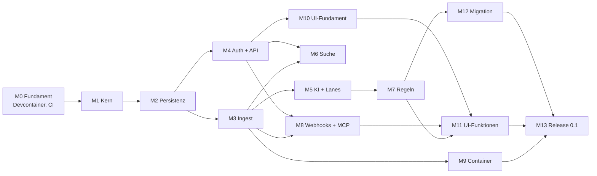

# Papiq – Umsetzungsplan

Stand: 06.10.2026 · Grundlage: [architektur.md](architektur.md)

Papiq wird API-first in 14 Meilensteinen (M0–M13) gebaut. Ab M3 lassen sich Dokumente per API einliefern; ab M11 ist Papiq über die Web-UI vollständig nutzbar; M13 schließt mit Release 0.1 und den ersten 100 Dokumenten ab.

## Abhängigkeiten

## Übersicht

| Kürzel | Meilenstein | Modell | Effort |
| --- | --- | --- | --- |
| M0 | Fundament: Devcontainer, CI, Konfiguration | Sonnet 5.5 | high |
| M1 | Domänenkern und Ports | Opus 5.5 | high |
| M2 | Persistenz (SQLite, Postgres), Jobs, Outbox | Opus 5.5 | high |
| M3 | Ingest-Pipeline: Speicher, OCR, Parsing, Worker, SSE | Opus 5.5 | high |
| M4 | Authentifizierung, Rechte, REST-API | Opus 5.5 | high (+ Review Fable 5.1 · high) |
| M5 | KI-Klassifizierung, Konfidenz, Lanes, Posteingang | Opus 5.5 | high |
| M6 | Suche mit Meilisearch | Sonnet 5.5 | high |
| M7 | Regel-Engine | Opus 5.5 | high |
| M8 | Webhooks und MCP-Server | Sonnet 5.5 | high |
| M9 | Papiq-Image mit s6-overlay | Sonnet 5.5 | high |
| M10 | Web-UI-Fundament und Design | Opus 5.5 | high |
| M11 | Web-UI-Funktionen | Sonnet 5.5 | medium (Regel-Baukasten: Opus 5.5 · high) |
| M12 | Migration aus Paperless-ngx | Sonnet 5.5 | high |
| M13 | Härtung und Release 0.1 | Fable 5.1 | high |

**Faustregel für die Modellwahl**

- **Opus 5.5** für alles, was Struktur festlegt oder schwer zu korrigieren ist: Kern, Datenmodell, Nebenläufigkeit, Sicherheit, Regel-Logik, Design-System.
- **Sonnet 5.5** für klar umrissene Integrationen nach festem Muster: Adapter, Container, Webhooks, Bildschirme nach Vorlage.
- **Fable 5.1** für unabhängige Prüfungen und lange, verifikationslastige Abschnitte (Sicherheits-Review, Release-Härtung).
- **Effort:** `medium` bei klarem Umfang, `high`, wenn Verifikation zählt (Default bei den meisten Modellen; Opus 5.5 startet bei `medium`). `xhigh`/`max` nur gezielt für einzelne harte Probleme, z. B. per `ultrathink` im Prompt. ([Quelle](https://code.claude.com/docs/en/model-config))
- Jeder Meilenstein beginnt mit einem Plan (Plan-Modus) und endet mit einem Review durch einen separaten Agenten, der die Umsetzung nicht geschrieben hat.

## Meilensteine

### M0 – Fundament: Devcontainer, CI, Konfiguration

**Ziel:** Entwickeln und Testen vollständig im Devcontainer; alle Abhängigkeiten starten mit.

- Devcontainer wie im Abschnitt [Devcontainer](#devcontainer) beschrieben.
- Mehrstufiges `Dockerfile` mit Ziel `dev` (Devcontainer) und `runtime` (M9), damit Entwicklung und Betrieb dieselben Systempakete nutzen.
- Konfiguration: `PAPIQ_`-Variablen mit Pydantic Settings, `_FILE`-Variablen für Docker Secrets, Abbruch bei ungültiger Konfiguration.
- Composition Root als Gerüst; strukturiertes Logging.
- CI: Lint, Typen, Import-Verträge, Tests; Testmatrix SQLite/Postgres vorbereitet.

**Fertig, wenn:** „Reopen in Container" startet Postgres, Garage und Meilisearch; `uv run pytest` läuft im Container grün; CI ist grün.

**Modell:** Sonnet 5.5 · high – viel bekanntes Muster, aber die Garage-Initialisierung und Netzwerk-Details brauchen Verifikation.

### M1 – Domänenkern und Ports

**Ziel:** Fachlogik ohne jede Technik, vollständig testbar.

- Entitäten: Nutzer, Rolle, Dokument, Kontakt, Dokumenttyp, Tag, Attribut-Definition und -Wert, Schublade, Freigabe, Lane, Verarbeitungsschritt.
- Rechteprüfung (Besitzer, Schublade, Freigabe lesen/schreiben).
- Zustandsautomat der Pipeline und Lane-Berechnung (schlechtestes Schrittergebnis).
- Ports mit echten async Signaturen; In-Memory-Adapter für jeden Port; Vertragstest-Suiten.

**Vorher klären:** Attribut-Datentypen.

**Fertig, wenn:** Kern-Tests decken Rechte, Zustandsautomat und Lanes ab; Import-Verträge grün.

**Modell:** Opus 5.5 · high – legt die Struktur fest, auf der alles aufbaut.

### M2 – Persistenz, Jobs, Outbox

**Ziel:** Repository-, Job-Queue- und Event-Bus-Adapter auf SQLite und Postgres.

- SQLAlchemy 2 async (aiosqlite, asyncpg), Alembic-Migrationen für beide Datenbanken.
- Job-Tabelle mit Retries, Sperren und Idempotenz.
- Outbox-Tabelle, Verteilung im Prozess; Polling (SQLite) und optional `LISTEN/NOTIFY` (Postgres).

**Fertig, wenn:** Vertragstests aus M1 laufen gegen SQLite und Postgres grün.

**Modell:** Opus 5.5 · high – die Verträge aus M1 verlangen u. a. lückenlose Ereigniszustellung trotz abweichender Commit-Reihenfolge und sicheres paralleles Claimen; das auf zwei Datenbanken braucht Verifikation.

### M3 – Ingest-Pipeline

**Ziel:** Ein Dokument per API einliefern und bis „Parsen" verarbeiten.

- Objektspeicher-Adapter: Dateisystem und S3 (Garage); SHA-256 als Schlüssel, Dublettenprüfung.
- `POST /documents` mit `202 Accepted`; Worker-Dienst; Schritte Empfangen → OCR → Parsen mit Retries.
- OCRmyPDF- und Docling-Adapter, rechenlastig in eigenen Prozessen.
- Verarbeitungsprotokoll je Schritt; „Schritt wiederholen", „ab Schritt X neu verarbeiten".
- Server-Sent Events für Fortschritt.

**Übernommen aus M2** (bewusst offen gelassen, in M3 entscheiden bzw. umsetzen):

- Outbox-Verteilung: Der Worker ruft `EventBus.dispatch` per Polling auf. Postgres `LISTEN/NOTIFY` ist nicht umgesetzt; nur ergänzen, wenn die Latenz des Pollings stört.
- Aufräumen: Erledigte und aufgegebene Jobs sowie Outbox-Einträge, die alle Abonnenten erhalten haben, wachsen unbegrenzt. Aufräum-Job vorsehen.
- Lebenszyklus: Der Container schließt die Datenbank-Engine (`Database.dispose`) noch nicht; mit dem Start und Stopp von Worker und API regeln.
- Fehlgeschlagene Zustellungen werden unbegrenzt wiederholt (`event_retries` zählt die Versuche); Obergrenze oder wachsender Abstand bei Bedarf.
- Mehrere Dispatcher mit demselben Abonnentennamen stellen ggf. doppelt zu (mindestens einmal ist erlaubt).
- SQLite hat einen Schreiber: Ein Task darf keine zweite schreibende Unit of Work öffnen, solange seine erste offen ist (wartet sonst bis zum Busy-Timeout).

**Fertig, wenn:** Ein PDF und ein Foto laufen durch, Archiv-PDF und Docling-Ausgabe liegen im Speicher, ein abgebrochener Schritt lässt sich einzeln wiederholen.

**Modell:** Opus 5.5 · high – Idempotenz, Prozesse und Fehlerpfade.

### M4 – Authentifizierung, Rechte, REST-API

**Ziel:** Mehrbenutzerbetrieb und vollständige API für Stammdaten und Schubladen.

- Nativer Login (Argon2id), TOTP optional, Session-Cookie, persönliche API-Tokens mit Stufen.
- OIDC über Authlib, Verknüpfung mit lokalem Konto.
- Endpunkte: Nutzer (Admin), Stammdaten (Admin), Schubladen und Freigaben, Dokumente; OpenAPI-Spezifikation sauber gepflegt.

**Fertig, wenn:** Rechte-Tests zeigen, dass kein Nutzer fremde Dokumente ohne Freigabe sieht; OpenAPI ist vollständig.

**Modell:** Opus 5.5 · high; danach Sicherheits-Review mit Fable 5.1 · high – sicherheitskritisch, unabhängige Prüfung lohnt.

**Review und Behebung:** Das unabhängige Sicherheits-Review (`reviews/M4-security.md`) fand keine kritischen, einen hohen, vier mittlere und sieben geringe Befunde. Behoben vor dem Merge: Quellen-Drossel sperrt nur noch falsche Anmeldungen, `PAPIQ_FORWARDED_ALLOW_IPS` ist mit `Secure`-Cookies Pflicht (M4-01); Fehlversuche werden atomar vor der Prüfung gezählt (M4-02); Admin-Endpunkte für Anmeldedaten nur per Session, kein Selbstbezug (M4-03); Request-Bodies begrenzt, `PAPIQ_REQUEST_MAX_SIZE` (M4-04); dazu M4-06 bis M4-11. M4-05 (Token-Widerruf bei Passwortwechsel als Default) bewusst nicht geändert, M4-12 akzeptiert. Auftrag: `prompts/M4-fixes.md`.

### M5 – KI-Klassifizierung, Konfidenz, Lanes

**Ziel:** Dokumente werden klassifiziert und landen in Grün, Gelb oder Rot.

- LLM- und Embedding-Adapter (OpenAI-kompatibel), strukturierte Ausgabe mit festem Schema.
- Klassifizierung (Kontakt, Typ, Tags), Attribut-Extraktion je Dokumenttyp.
- Konfidenz aus prüfbaren Fakten (Abgleich, Liste, Wert im Text); neue Gegebenheiten → Gelb.
- Posteingang (API): gelbe und rote Dokumente nur für den Besitzer.
- Kleiner Bewertungssatz aus Beispieldokumenten, um Modelle vergleichen zu können.

**Vorher klären:** LLM und Embedding-Modell, Konfidenz-Schwellen, Anzahl Retries.

**Fertig, wenn:** Der Bewertungssatz läuft reproduzierbar; Lanes stimmen mit den Erwartungen überein.

**Modell:** Opus 5.5 · high – Prompt- und Schema-Design, Bewertung.

**Review und Behebung:** Das Review durch einen separaten Agenten fand keine Blocker. Behoben vor dem Merge: Ein Kontakt wird nur grün, wenn er selbst im Text steht (ähnliche Schreibweise → Vorschlag); Belege nur als ganze Wörter, nur ISO-4217-Codes als Währung, Ja/Nein- und Auswahlwerte brauchen eine Belegstelle von mindestens 4 Zeichen; Tags aus der Klassifizierung werden ergänzt statt ersetzt; beim Bestätigen gelten Werte, die das Dokument schon hat, als entschieden (Vorschläge füllen nur leere Felder); die Bewertung zählt „grün mit falschem Wert" und bricht dann mit Status 1 ab. Als Restrisiko akzeptiert (Tobi, 07.10.2026): siehe „Übernommen aus M5" unter M6.

### M6 – Suche

**Ziel:** Hybride Suche, gefiltert nach Rechten.

- Meilisearch-Adapter, Index-Aktualisierung per Ereignis, vollständiger Neuaufbau per Job.
- Jede Suche gefiltert auf sichtbare Schubladen.

**Übernommen aus M5** (offen bzw. für spätere Meilensteine festgehalten):

- Embedding-Port und OpenAI-kompatibler Adapter existieren (`PAPIQ_EMBEDDING_*`), werden aber noch nicht genutzt; die hybride Suche baut darauf auf.
- Echter Bewertungslauf (07.10.2026, Ergebnis in `architektur.md`): `qwen3:8b` mit 8192 Kontext, nur 5 der 28 Dokumente (Tobis Wahl). Offen: der volle Lauf (auf dem NUC etwa 1,5 bis 2,5 Stunden). Auf dem NUC liegt dafür die Modellvariante `qwen3:8b-ctx8k` (`num_ctx` 8192); für den Betrieb `OLLAMA_CONTEXT_LENGTH=8192` auf dem NUC setzen.
- Laufzeit 3 bis 10 Minuten pro Dokument auf der CPU des NUC: für die Migration (M12) mit vielen Dokumenten einplanen (Klassifizierung abschaltbar oder nachgelagert?).
- `bge-m3` ist auf dem NUC geladen, aber ungeprüft; die Wahl in M6 bestätigen.
- Restrisiko (akzeptiert): Eine Anweisung im Dokumenttext kann einen falschen, aber vorhandenen Kontakt grün machen, wenn der Text diesen Kontakt nennt. Tags aus der Klassifizierung werden ohne Textprüfung gesetzt. Für M7: Regeln dürfen Kontakt und Tags, die das Modell gesetzt hat, nicht allein vertrauen.
- Für M7: `inbox.field_checks(log)` liefert die Vorschläge und Prüfungen des letzten Modelllaufs je Feld; Bestätigungen stehen mit `model_version="person"` im Verarbeitungsprotokoll. Ohne Regeln setzt `confirm` nach dem Bestätigen bei `apply_rules` fort.
- Bestätigen ab `extract_attributes` ersetzt die Attribute, die der Besitzer eingetragen hat (dokumentiert, bewusst so).
- Feldprüfungen werden als bestanden protokolliert, auch wenn die Änderung danach an fehlenden Stammdaten scheitert (der Schritt wird dann unsicher).
- Fehlender Test: Klassifizierung auf Postgres im Integrationstest (bisher nur Speicher-Adapter und Rundlauf des Status `review`).

**Fertig, wenn:** Rechte-Tests für die Suche grün; Neuaufbau aus Datenbank und Speicher funktioniert.

**Modell:** Sonnet 5.5 · high – bekannte Integration, der Rechtefilter braucht Sorgfalt.

**Umsetzung und Review:** Index-Port `SearchIndex` mit Speicher- und Meilisearch-Adapter (httpx2, kein SDK), Vektoren über den Embedding-Port (`userProvided`), Abschnitte statt eines Vektors je Dokument, `GET /documents/search`, `POST /search/reindex`, Befehl `reindex`, `evaluate-search` mit 48 Anfragen. Das Review durch einen separaten Agenten fand keine Rechte-Lücke. Behoben vor dem Merge: Embedding-Ausfall hält ein Dokument nicht mehr aus dem Index; Umbenennungen während eines Neuaufbaus gehen nicht verloren; Abgleich bei jedem Start des Workers; Vektoren falscher Länge fallen auf Wörter zurück; Paging mit Bedeutung; ein Index ohne Einstellungen wird neu eingerichtet; `/health` meldet eine gestörte Suche als `degraded` (Tobi, 07.10.2026). Embedding-Modell: `snowflake-arctic-embed2` (Tobi, 07.10.2026, Bewertung in `architektur.md` unter „Suche“). Der Test der Klassifizierung auf SQL-Persistenz (Übergabe aus M5) liegt in `tests/integration/test_classification_evaluation.py`.

### M7 – Regel-Engine

**Ziel:** Globale und Nutzer-Regeln wie spezifiziert.

- Bedingungsbaum, Operatoren, Aktionen, Priorität, Konflikte → Gelb (auch Regel gegen LLM).
- Versionierung, Protokoll, Probelauf bei Dokumentänderungen.
- Rückwirkendes Anwenden: Ermittlung der betroffenen Dokumente und Ausführung als Job (Auswahl in der UI folgt in M11).

**Fertig, wenn:** Tests decken Konflikte, Schleifenschutz und Rechtegrenzen globaler Regeln ab.

**Übernommen aus M6** (offen bzw. für spätere Meilensteine festgehalten):

- Jede Dokumentänderung (auch durch Regeln oder rückwirkendes Anwenden) löst über das Ereignis `document.updated`/`lane_changed`/`filed` einen Index-Job aus; Regeln müssen nichts am Index tun. Ändert eine Regel viele Dokumente, entstehen viele Index-Jobs und Embeddings: auf dem NUC etwa 0,6 s je Abschnitt.
- Für M8 (MCP-Tool `search`): `SearchService.search(actor, text, filter, offset=, limit=, semantic_ratio=)` prüft Rechte selbst; der MCP-Server ruft ihn mit dem Besitzer des Tokens auf. Eine Seite kann weniger Treffer als `limit` enthalten.
- Die hybride Suche hat keine Schwelle: Meilisearch liefert auch bei Unsinn die nächsten Nachbarn. Eine Schwelle (`rankingScoreThreshold`) wäre eine eigene Entscheidung, am besten mit dem Bewertungssatz erweitert um Anfragen ohne Treffer.
- Der Neuaufbau belegt eine Worker-Schleife; seine Leihe (`PAPIQ_SEARCH_REBUILD_TIMEOUT`) wird nicht verlängert. Der Befehl `reindex` und ein laufender Neuaufbau-Job dürfen nicht gleichzeitig laufen (nur in der Dokumentation, nicht erzwungen).
- Ein Modellwechsel oder eine andere Vektorlänge braucht einen Neuaufbau; der Adapter bricht ab, wenn ein Index mit anderem Embedder Dokumente enthält.
- `PAPIQ_SEARCH_LOCALES` prüft nur das Format, nicht ob Meilisearch die Sprache kennt.
- Nicht in dieser Umgebung geprüft (läuft in der CI): der Rundlauf `test_search_end_to_end` mit Postgres und S3 und die Postgres-Variante von `test_classification_evaluation`.
- Für `evaluate-search` ist `PAPIQ_EMBEDDING_DIMENSIONS` irgendein Wert, weil die Konfiguration zuerst geprüft wird; Präfixe gelten für alle Modelle eines Laufs.

**Modell:** Opus 5.5 · high – viele Randfälle, Wechselwirkung mit Rechten.

**Review und Behebung:** Das Review durch einen separaten Agenten fand keine Blocker. Behoben vor dem Merge: Rückwirkend gilt Ablegen in eine geteilte Schublade auf unbestätigte Modellwerte als Konflikt (nur mit Annahme); eine beim Upload oder durch Verschieben gewählte Schublade und früher von der Person gesetzte Tags und Felder ändert keine Regel mehr (Protokoll `person:drawer`); Bestätigen beantwortet nur die gesehenen erzwungenen Prüfungen; Bestätigen verlangt eine Schublade, wenn die Ablage sonst wieder scheitert; ein Bearbeiter, dem eine Änderung die Sicht nimmt, erhält nur `id` und `access: null`; Regex-Suchen teilen sich ein Zeitbudget (2 s je Lauf, 20 s je Vorschau-Seite); rückwirkende Anwendungen enden bei einem unerwarteten Fehler; SQL lädt nur die aktuelle Regelversion.

### M8 – Webhooks und MCP-Server

**Ziel:** Externe Systeme informieren und Claude anbinden.

- Webhook-Abonnements pro Nutzer, schlanke Ereignisse, HMAC-SHA256, Retries, Zustellprotokoll.
- MCP-Server über HTTP mit API-Token: `search`, `get_document`, `get_text`, `update_metadata`, `list_tags`.

**Fertig, wenn:** Ein Test-Empfänger erhält signierte Ereignisse; ein lokaler MCP-Client kann suchen und Metadaten ändern.

**Übernommen aus M6 und M7** (offen bzw. für spätere Meilensteine festgehalten):

- Aus M6: Für das MCP-Tool `search` prüft `SearchService.search(actor, text, filter, offset=, limit=, semantic_ratio=)` die Rechte selbst; der MCP-Server ruft ihn mit dem Besitzer des Tokens auf. Eine Seite kann weniger Treffer als `limit` enthalten. Die übrigen Punkte aus „Übernommen aus M6" unter M7 (Schwelle der hybriden Suche, Neuaufbau, Modellwechsel, Locales, Postgres-Läufe in der CI) gelten weiter.
- MCP-Tool `update_metadata`: über `DocumentService.change_metadata(actor, id, changes)` gehen, nicht über `update_metadata`; nur so laufen die Änderungs-Regeln (Flanke), und das Ergebnis enthält den Regelbericht (`rules`, nur für den Besitzer) und `access` (None, wenn die Regeln das Dokument aus der Sicht des Aufrufers abgelegt haben: dann nichts weiter zurückgeben, wie REST).
- Webhooks: `document.filed` kommt auch, wenn eine Regel in `apply_rules` oder `confirm(drawer_id)` das Dokument verschiebt, solange es noch keine Lane hat (früher als die endgültige Ablage). Für Abonnenten zählt erst `document.filed` bei grüner Lane; ggf. im Ereignis die Lane mitgeben oder `move_to` vor der Ablage kein `filed` melden lassen.
- Webhooks: Regeländerungen und rückwirkende Anwendungen erzeugen keine eigenen Ereignisse; Fortschritt nur per `GET /rule-applications/{id}`.
- Offen aus M7: Kein In-Memory-Adapter für `PatternMatcher` (der Speicher-Container nutzt den `regex`-Adapter, der ohne Dienst läuft). `RuleApplication` schreibt `documents`/`skipped` je Dokument neu (quadratisch, bei `PAPIQ_RULES_APPLY_MAX_DOCUMENTS` nahe 100 000 relevant). Kleines Zeitfenster: Text und Muster werden vor der Transaktion für die dann gesehenen Regeln vorbereitet; eine dazwischen aktivierte Textregel wird ohne Text ausgewertet. Keine Obergrenze für Regeln je Nutzer (das Zeitbudget begrenzt die Kosten).
- Nicht in dieser Umgebung geprüft (läuft in der CI): Regel-Vertragstests und `test_rules_end_to_end` auf Postgres.

**Modell:** Sonnet 5.5 · high.

**Umsetzung und Review:** Webhooks (`/webhooks`, Zustellprotokoll, `POST /webhooks/{id}/test`): Abonnent `webhooks.fanout` und Job `webhooks.deliver` im Worker, Rechte beim Einreihen und vor jedem Versuch (sonst `dropped`), `document.deleted` an die Leser zum Zeitpunkt des Löschens (`DocumentDeleted.readers`, auch für SSE), Signatur nach Standard Webhooks (`webhook-id`, `-timestamp`, `-signature`, zwei Signaturen während der Übergangszeit nach dem Erneuern), Geheimnis AES-GCM-verschlüsselt, Wiederholung 10 Versuche ab 30 s verdoppelnd bis 1 h, Abschalten nach 20 aufgegebenen in Folge, Aufräumen des Protokolls über `PAPIQ_RETENTION`. MCP unter `/api/v1/mcp` mit dem offiziellen SDK (`mcp==2.3.0`), fünf Tools, Namen statt IDs, Bearer-Token mit Stufen. Admins haben alle Rechte an allen Webhooks: lesen, ändern, löschen, testen, Geheimnis erneuern (Tobi, 08.10.2026); ein von ihnen erneuertes Geheimnis sehen sie einmal. Das Review durch einen separaten Agenten fand keine Rechte-Lücke bei Ereignissen und MCP. Behoben vor dem Merge: Der HTTP-Client protokollierte die volle Ziel-URL (kann ein Zugangsdatum enthalten) – die Logger `httpx`, `httpx2` und `httpcore` zeigen nur noch Warnungen; `dropped` nennt für gelöschte und nicht mehr sichtbare Dokumente denselben Grund; Geheimnisse stehen nicht mehr in `repr`.

### M9 – Papiq-Image mit s6-overlay

**Ziel:** Ein betriebsfertiges Image.

- `runtime`-Ziel im Dockerfile: Debian slim, OCRmyPDF-Abhängigkeiten, Docling mit PyTorch (CPU).
- s6-Dienste: `init-papiq`, `init-migrations`, `svc-api`, `svc-worker`; `PAPIQ_ROLE`, `PUID`/`PGID`, Healthchecks.
- Beispiel-Compose für SQLite + Dateisystem und für Postgres + Garage.
- CI baut Images für amd64 und arm64.

**Vorher klären:** Backup-Strategie.

**Übernommen aus M8:**

- Der Worker braucht jetzt `PAPIQ_SECRET_KEY` (Webhook-Geheimnisse); die Einstellungen verlangen ihn für jede Rolle, auch für `check` und `migrate`. Das Image muss ihn (oder `PAPIQ_SECRET_KEY_FILE`) allen s6-Diensten geben.
- Neue Variablen: `PAPIQ_WEBHOOKS_PER_USER`, `PAPIQ_WEBHOOK_SECRET_GRACE`, `PAPIQ_WEBHOOK_TIMEOUT`, `PAPIQ_WEBHOOK_MAX_ATTEMPTS`, `PAPIQ_WEBHOOK_RETRY_DELAY`, `PAPIQ_WEBHOOK_DISABLE_AFTER`, `PAPIQ_WEBHOOK_CONCURRENCY`, `PAPIQ_MCP_ENABLED`, `PAPIQ_MCP_TEXT_MAX`; in die Beispiel-Compose-Dateien und die Doku des Images aufnehmen.
- MCP liegt im API-Prozess unter `/api/v1/mcp` (Streamable HTTP, zustandslos). Ein Reverse Proxy darf es nicht puffern oder auf eine Antwortzeit begrenzen; Anfragen sind einfache `POST`s.
- Die Worker-Rolle stellt Webhooks zu und braucht Netzzugang zu den Zielen (auch im eigenen Netz, das ist entschieden). Weiterleitungen werden nie verfolgt, Proxy-Umgebungsvariablen nie ausgewertet.
- Ein toter Empfänger belegt eine Zustellschleife bis zum Zeitlimit je Versuch (`PAPIQ_WEBHOOK_CONCURRENCY`); die Pipeline bleibt unberührt.
- Offen (M8): `POST /webhooks/{id}/test` ohne Ratenbegrenzung (ein Token mit Schreibstufe kann interne Adressen anstoßen, akzeptiert); `Webhook.previous_secret` bleibt nach Ablauf der Übergangszeit verschlüsselt in der Datenbank bis zum nächsten Erneuern; Admins sehen in Zustellprotokollen Dokument-IDs und die Ziel-URL fremder Webhooks (entschieden, so gewollt).
- Nicht in dieser Umgebung geprüft (läuft in der CI): die Vertragstests für Webhooks auf Postgres, die Migration `v0006` auf Postgres, ein echter MCP-Client (Claude Code, Inspector) gegen einen laufenden API-Prozess.

**Fertig, wenn:** Beide Beispiel-Stacks starten, migrieren und verarbeiten ein Dokument.

**Modell:** Sonnet 5.5 · high.

**Umsetzung und Review:** Stufen `deps` (gesperrte Abhängigkeiten ohne Dev-Gruppe), `app`, `s6` (s6-overlay 3.2.3.2, SHA-256 je Architektur) und `runtime`; `docling-models` baut auf `deps` (ein `uv sync` für `dev` und `runtime`). Dienste `init-papiq`, `init-migrations`, `svc-api`, `svc-worker` unter `deploy/image/rootfs`; die Rolle (`PAPIQ_ROLE`) prüft jedes Dienstskript (`s6-svc -Od .`, s6-rc ist statisch); der Worker wartet in `svc-worker` mit dem neuen, schreibfreien Befehl `check-schema --wait 600` auf das Schema (nicht in `init-migrations`: ein Oneshot ließe sich mit `docker stop` nicht unterbrechen; Review-Befund). Papiq-Prozesse laufen über `papiq-run` als `PUID`:`PGID` (Default 1000, `0` abgelehnt, kein passwd-Eintrag); `/data` ist das Volume (Pfade per Image-`ENV`, `settings.py` unverändert); `init-papiq` lehnt relative Pfade, `/` und Systemordner ab. Herunterfahren: Worker 30 s, `S6_SERVICES_GRACETIME` 40 s, `S6_KILL_GRACETIME` 1 s (s6 wartet sie immer ganz ab), Compose `stop_grace_period` 60 s. Healthcheck: API über `/api/v1/health`, Worker über `s6-svstat` (mindestens 10 s oben) und eine Marke, dass das Warten auf das Schema vorbei ist. Hilfsbefehl `papiq` (`docker exec … papiq reindex`). Beispiel-Stacks `deploy/compose.sqlite.yml` und `compose.postgres.yml` mit Secrets als Dateien (`create-secrets.sh`), `deploy/test-image.sh` (31 Prüfungen, auch in der CI), `deploy/README.md` mit Betrieb, Reverse Proxy, Webhooks, MCP, Backup und Wiederherstellung. Größe laut `docker image inspect` in der CI: 3,19 GB (amd64), 3,02 GB (arm64); OrbStack auf dem Mac zeigt 4,57 GB.

Echtläufe auf Tobis Mac (Ollama am NUC, `qwen3:8b-ctx8k` und `snowflake-arctic-embed2`): beide Stacks, je zwei PDFs (gerenderte Stromrechnung und Handwerkerrechnung aus dem Bewertungssatz) bis Lane Gelb in 66 bis 96 s (Kontakt und Typ unbekannt, Stammdaten leer), Suche semantisch; MCP gegen den laufenden Container mit dem MCP-SDK-Client (alle fünf Tools, `update_metadata` eingeschlossen) und mit Claude Code (`claude -p` mit `--mcp-config`); Backup und Wiederherstellung mit beiden Stacks durchgespielt (Dokument, Original, Archiv und Suche nach `reindex` wieder da). CI-Zeiten des Image-Jobs (Pull Request, je Architektur nativ): kalt 4:05 bis 4:17 (Bau 2:27 bis 2:28, Test 75 bis 83 s); mit GHA-Layer-Cache nicht schneller (Wiederherstellen rund 1 min, Schreiben aus `main` weitere 2 min), deshalb ohne Cache und nur im Pull Request. Pull Requests ohne Image-Pfad bleiben unberührt (Job `changes` 4 bis 5 s, `backend` 1:00, `integration` 2:47). Das Review durch einen separaten Agenten fand keine Lücke bei Geheimnissen (alle Beispielgeheimnisse in Logs und `docker inspect` gesucht) und Rechten (nur `s6-supervise` läuft als root). Behoben vor dem Merge: das Warten des Workers (siehe oben), Pfadprüfung in `init-papiq`, Angaben der Backup-Doku (Originale unveränderlich, Ableitungen nicht; Wiederherstellung ersetzt Objekte; `alpine` gepinnt), Hinweis, Geheimnisse nur als `_FILE` zu übergeben.

### M10 – Web-UI-Fundament

**Ziel:** Cleanes, modernes Grundgerüst, auf dem alle Bildschirme aufbauen.

- SvelteKit (statisch), Tailwind, shadcn-svelte; TypeScript-Client aus OpenAPI generiert.
- Gestaltungsrichtung, Farben, Typografie, Dark Mode; Login inkl. TOTP; Navigation.

**Fertig, wenn:** Login funktioniert, Design-System steht, Uvicorn liefert die gebaute UI aus.

**Modell:** Opus 5.5 · high – Gestaltungsentscheidungen prägen die ganze UI.

**Übernommen aus M9:**

- Die UI kommt ins Image: eine Node-Stufe im `Dockerfile` baut die statischen Dateien, die Stufe `runtime` kopiert sie; `.dockerignore` lässt `web/` durch (heute nur `backend/pyproject.toml`, `uv.lock`, `README.md`, `src/`, `deploy/image/`). Wie Uvicorn sie ausliefert (Pfad, Einstellung `PAPIQ_…`, Vorrang der API-Pfade unter `/api/v1`), entscheidet M10; `deploy/README.md` und der Reverse-Proxy-Abschnitt (Cache-Header, Pfade) nachziehen.
- CI: Der Job `image` löst bei `web/` heute nicht aus (Pfade in `changes`: `Dockerfile`, `.dockerignore`, `deploy/` ohne Markdown, `backend/pyproject.toml`, `backend/uv.lock`, `ci.yml`). Sobald die UI im Image steckt, `web/` (ohne Tests und Markdown) und die Lock-Datei der UI aufnehmen und `deploy/test-image.sh` um einen Abruf der Startseite erweitern.
- Das Betriebsbild für die UI-Entwicklung bleibt der Devcontainer; das Image wird nur gebaut, nicht für Vite genutzt.
- Offen aus M8 (unverändert weitergetragen): `POST /webhooks/{id}/test` ohne Ratenbegrenzung, `Webhook.previous_secret` bleibt nach der Übergangszeit verschlüsselt liegen, Admins sehen Dokument-IDs und Ziel-URL fremder Webhooks (entschieden); dazu die Punkte aus „Übernommen aus M6 und M7" (Schwelle der hybriden Suche, Neuaufbau-Leihe, Modellwechsel, `PAPIQ_SEARCH_LOCALES`, `PatternMatcher` ohne In-Memory-Adapter, quadratisches Schreiben in `RuleApplication`, Zeitfenster bei Textregeln, keine Obergrenze für Regeln je Nutzer).

**Umsetzung und Review:** SvelteKit 3.0.1 als Single-Page-App (`adapter-static`, Fallback `index.html`, kein SSR) unter `/ui`, Svelte 5, Vite 8, TypeScript 6, Tailwind 4, shadcn-svelte (bits-ui), Paraglide JS 2 (Englisch als Basis, Deutsch; Wahl im Browser gespeichert, Formate nach Browser-Region, sonst de-DE/en-US), Schriften Geist und Geist Mono lokal, alles exakt gepinnt (`pnpm-lock.yaml`, pnpm 12.9.1, Node 24.21.0). Gestaltung Richtung B „Papier" (Tobi, 08.10.2026; Artifact mit drei Richtungen): Petrol `#0d6b6b` als einziger Akzent, Papierweiß, runde Formen, Kopfnavigation mit Pillen, Lanes „Erledigt/Prüfen/Eingreifen/Läuft" immer mit Symbol und Wort. Client: `openapi-typescript` aus dem eingecheckten `web/openapi.json` (Befehl `python -m papiq.composition.openapi`, ein Backend-Test vergleicht) und `openapi-fetch` mit eigenem `fetch` (Cookie der Seite, `X-CSRF-Token` nur bei Änderungen, ein Wiederholversuch bei veraltetem Token, 401 außerhalb der Anmeldung → Login mit `next`). Anmeldung mit Passwort, TOTP, Wiederherstellungscode und OIDC-Knopf (nur wenn eingerichtet); `next` nur auf Seiten unter `/ui/`. Auslieferung: `PAPIQ_UI_DIR` (im Image `/opt/papiq/ui`; gesetzt ohne `index.html` ist ein Konfigurationsfehler), `adapters/inbound/rest/ui.py` nach allen API-Routen, `/` → 302 `/ui/`, `/ui` → 308; Dateien des Builds, sonst `index.html` für Seitenpfade ohne Endung, 404-Problem für fehlende Dateien, alles unter `_app/`, versteckte Namen, Pfade außerhalb; nur GET/HEAD. `_app/immutable` ein Jahr `immutable`, alles andere `no-cache` mit ETag/304. CSP per Meta-Tag aus SvelteKit (Hash-Modus), als Header `frame-ancestors 'none'`, `nosniff`, `Referrer-Policy: same-origin`. Image: Stufe `web` auf der Bauplattform, `runtime` ohne Node. CI: Job `web` (ESLint, Prettier, svelte-check, Vitest, Client-Abgleich, Build), nur bei `web/`; `image` auch bei `web/` ohne Tests. Tests: 172 Vitest (u. a. kein fester Text im Markup, gleiche Schlüssel und Platzhalter in beiden Sprachen, `next`-Prüfung), 30 Backend-Tests der Auslieferung, Playwright-Rauchtest nur lokal (gelaufen: Anmeldung mit TOTP, Navigation, Neuladen, Abmelden, Rücksprung nach Sitzungsende). Das Review durch einen separaten Agenten fand keinen offenen Weg aus `next` heraus und keinen Pfadausbruch. Behoben vor dem Merge: die CSRF-Wiederholung lief nach einer Anmeldung in einem anderen Tab als die andere Person (jetzt nur bei gleicher Nutzer-ID, sonst neu laden); API-Änderungen ohne UI-Bezug lösten den Image-Job aus (`openapi.json`, `schema.ts` ausgenommen); Tastaturfokus zu blass (jetzt 2-px-Umriss in Petrol mit Abstand, 6:1); Fehler beim Laden einer Seite zeigten Englisch „Internal Error“ ohne das Detail der API (`hooks.client.ts`; dabei gefunden: `openapi-fetch` liest den Fehlerkörper selbst, `apiError` nimmt ihn jetzt entgegen); doppelte Schrägstriche umgingen die Regeln für `_app/`; 405 hatte den Titel „405“; Fokus und `aria-describedby` auf der Anmeldeseite; CSRF-Kopf nur an die eigene Seite.

### M11 – Web-UI-Funktionen

**Ziel:** Papiq vollständig über die Oberfläche nutzbar.

- Dokumentliste und -detail mit PDF.js, Upload, Fortschritt per SSE.
- Posteingang mit Lanes, Bestätigen und Korrigieren.
- Schubladen und Freigaben, Stammdaten (Admin), Webhooks, API-Tokens, Einstellungen.
- Regel-Baukasten mit Probelauf und Auswahldialog für rückwirkendes Anwenden.

**Übernommen aus M10:**

- Gerüst: `web/README.md`. Neue Seiten liegen unter `src/routes/(app)/…` (Layout prüft die Sitzung), Bereiche in `src/lib/sections.ts`; die Platzhalterseiten (`Placeholder.svelte`) werden ersetzt. Bausteine aus shadcn-svelte per CLI (`pnpm dlx shadcn-svelte@1.7.0 add …`, `components.json`), danach Texte über Paraglide; die Bausteinseite `/ui/dev/components` (nur `pnpm dev`) zeigt den Stand.
- Importe heißen `#lib/…` mit Dateiendung (SvelteKit 3 hat `$lib` entfernt; `imports` in `package.json`), `$app/env` statt `$app/environment`.
- Jeder sichtbare Text in `messages/{en,de}.json`; die Tests schlagen bei festem Text im Markup (auch `aria-label`, `title`, `placeholder`, `alt`) und bei fehlenden Schlüsseln an. Fehlertexte der API (Problem-Details) bleiben, wie die API sie schreibt.
- API-Aufrufe nur über `api` aus `#lib/api/client.ts`; Fehler mit `describeError`/`reportError` (`#lib/errors.ts`), 429 nennt die Wartezeit. Nach einer API-Änderung `web/openapi.json` neu schreiben und `pnpm gen:api`.
- Formate über `formatDate`, `formatNumber`, `formatMoney` (`#lib/i18n.ts`); Lanes über `LaneBadge`.
- CSP: `img-src` erlaubt `data:` und `blob:` (PDF-Vorschau), `connect-src 'self'` (SSE unter `/api/v1/events` passt). PDF.js braucht vermutlich einen Worker (`worker-src`) und darf kein CDN nutzen; die Direktiven stehen in `web/vite.config.ts`.
- Neue Abhängigkeiten nur nach Absprache und exakt gepinnt; pnpm 12 lehnt Pakete jünger als einen Tag ab (`minimumReleaseAge`).
- Nicht gebaut: Superforms, Zod, TanStack (E6); bei Formularen mit vielen Feldern neu entscheiden.
- Beobachtet: Bricht die OIDC-Anmeldung beim Anbieter ab, zeigt `/api/v1/auth/oidc/callback` ein Problem-JSON statt einer Seite der UI.
- Seitenpfade dürfen im letzten Abschnitt keinen Punkt enthalten (`/ui/users/john.doe`): die Auslieferung hält ihn für eine Datei und antwortet 404. IDs (UUID) sind unkritisch; Namen nicht als Pfadparameter.
- CSP: `style-src 'unsafe-inline'` ist weiter als nötig; laut Review erzeugt das Bündel keine `<style>`-Elemente, `style-src 'self'; style-src-attr 'unsafe-inline'` könnte reichen (im Browser prüfen, auch mit PDF.js).
- Playwright läuft nur lokal (`pnpm e2e`, `web/README.md`), die CI installiert keine Browser.

**Fertig, wenn:** Alle Abläufe aus dem Architektur-Dokument sind in der UI erreichbar.

**Modell:** Sonnet 5.5 · medium für Bildschirme nach Vorlage; Regel-Baukasten mit Opus 5.5 · high.

**Umsetzung und Review (M11a, ohne Regelbereich):** Tobis Entscheidungen (08.10.2026): Regeln komplett M11b (der Probelauf für Dokumente gehört zu M11a); Formulare ohne Superforms, Zod, TanStack; QR-Code für TOTP mit `uqr` 0.1.3 als SVG; OIDC-Fehler leitet auf `/ui/login?error=<code>` (Codes `denied`, `failed`, `conflict`, `provider`; bei verknüpfendem Aufruf mit Sitzung auf `/ui/settings?error=<code>`); Dokumentliste ohne Sortierung, „Mehr laden“; Suche ohne Gewichtungsregler; keine neue Design-Runde. Neue Abhängigkeiten: `pdfjs-dist` 6.4.299 (Legacy-Build, weil der normale `Map.getOrInsertComputed` braucht), `uqr` 0.1.3. Umgesetzt: Dokumentliste mit Filtern und Ereignisstrom (eine `EventSource`, Neuladen nach Wiederverbindung), Upload (3 parallel, nur Status „lädt hoch“, dann SSE), Detail mit schlankem PDF-Viewer, Bearbeiten mit Probelauf vor dem Speichern, Verarbeitungsprotokoll, Wiederholen, Neuverarbeiten, Verschieben, Löschen; Posteingang mit Zähler und Bestätigen/Korrigieren; Suche; Schubladen mit Freigaben; Stammdaten (Kontakte, Dokumenttypen, Schlagwörter, Attribute); Benutzerverwaltung; Webhooks mit Zustellprotokoll; Einstellungen (Passwort, TOTP mit QR und Wiederherstellungscodes, OIDC verknüpfen, andere Sitzungen beenden, API-Tokens). Einzige API-Änderung: der OIDC-Callback (mit Test, `openapi.json` und Client neu erzeugt). CSP: `style-src 'self'` plus `style-src-attr 'unsafe-inline'` und `worker-src 'self'`, im Browser mit PDF.js ohne Verstöße; `wasm-unsafe-eval` war nicht nötig. Tests: 259 Vitest, 1973 Backend-Unit-Tests, Playwright lokal (`areas.spec.ts` öffnet alle Bereiche ohne Konsolenfehler und legt Kontakt, Schublade, Webhook und Token an und wieder weg). Das Review durch einen separaten Agenten fand und behoben vor dem Merge: `loading` blieb nach `refresh()` während `more()` für immer gesetzt (Test ergänzt); Webhook-Test und Geheimnis erneuern sowie das Verarbeitungsprotokoll wurden auch gezeigt, wo die API „nur Eigentümer“ sagt; das Formular wurde bei jedem Ereignis zurückgesetzt und löschte Eingaben (jetzt nur, wenn nichts geändert ist); Admins bekamen für Upload und Prüfen Schubladen angeboten, in die sie nicht schreiben dürfen; späte Antworten eines früheren Dokuments konnten das aktuelle überschreiben; Uploads blieben nach Abmelden stehen; Neustart des Ereignisstroms nach Abmeldung; zwei Layouts des PDF-Viewers konnten sich überholen; Namensabruf der Webhook-Seite ohne Fehlerbehandlung.

**Übergaben an M11b:**

- Die Seite `/ui/rules` ist weiter ein Platzhalter (`Placeholder.svelte`, Eintrag in `src/lib/sections.ts`). Wiederverwendbar: `PagedList` (`paging.svelte.ts`), `NativeSelect`, `ConfirmDialog`, `NameDialog`, `AttributeField`, `ReviewFieldInput`, `loadLookup` (Kontakte, Typen, Schlagwörter, Attribute, Schubladen, Benutzer; `masterdata.svelte.ts`), `permissions.ts`, `events.svelte.ts` (`generation` nach Wiederverbindung), `fieldErrors` (422-Details je Feld) und der Probelauf-Dialog des `DocumentEditor` als Vorlage für die Vorschau von Regeln.
- Texte: `web/messages/{en,de}.json`, Hilfsskript ist nicht eingecheckt; Schlüssel in beiden Sprachen, sonst schlägt der Test an.
- Rechte zeigt die UI nur als Komfort, die API entscheidet. Laut Endpunktbeschreibung sind „Test senden“ und „Geheimnis erneuern“ eines Webhooks sowie das Verarbeitungsprotokoll eines Dokuments nur für den Eigentümer, auch für Admins; `GET /drawers` liefert Admins nur eigene und freigegebene Schubladen. Das passt nicht zu „Admins haben alle Rechte und sehen alles“: bei Bedarf in der API ändern und die UI nachziehen (`permissions.ts`, `webhooks/+page.svelte`).
- Nur mit abgefangenen API-Antworten geprüft (lokal gibt es weder Meilisearch noch ein Modell): die gelbe Prüfansicht mit Vorschlägen, Suchtreffer, die rote Spur. Beim ersten Lauf mit echten Diensten ansehen.
- Offen: `img-src` erlaubt weiter `blob:`; wahrscheinlich überflüssig, weil kein Code Blob-URLs erzeugt (mit einem PDF mit JBIG2/JPX prüfen, dann streichen). Kein Byte-Fortschritt beim Upload (nur Status). Für Währung gibt es keinen Attributtyp, die API speichert sie je Wert.
- Unverändert weitergetragen: die Punkte aus „Übernommen aus M10“ (offen aus M8, M6 und M7, M9).

**Umsetzung und Review (M11b):** Tobis Entscheidungen (08.10.2026): E1 Admins haben alle Rechte und sehen alles; E2 Probelauf vor dem Einschalten (Regel wird ausgeschaltet gespeichert); E3 Konflikte nie vorausgewählt, eigenes Häkchen (`accept_conflicts`); E4 Versionen nur ansehen; E5 kein JSON-Editor; F1a SSE für Admins zu allen Dokumenten, Webhooks nur Reichweite des Besitzers; F2a Schublade einer Nutzer-Regel gegen deren Besitzer; F3a Listen zeigen die Reichweite, Admins schalten mit `all_users` um; F4a Admins legen in jede Schublade ab, auch beim Bestätigen; F5a neue Regel per POST, dann PATCH `enabled=false`. Umgesetzt: Rechte in `permissions.py` (`can_control_document`, Reichweite für Listen und Webhooks), Ports `DocumentRepository.query` und `Visibility.everything` mit Vertragstests, `all_users` an Dokumentliste, Posteingang und Suche, Admins sehen und verwalten alle Schubladen, Regeln und Webhooks; `architektur.md` angepasst. Fehler beim Speichern einer Regel nennen den Ort. UI: Umschalter „Alle Nutzer“, Besitzer an fremden Dokumenten, fremde Schubladen; Regelliste, Baukasten (verschachtelte Gruppen bis Tiefe 5, alle Felder, Operatoren und Aktionen, Platzhalter, Prüfung vor dem Speichern, API-Fehler am Block), Ansicht, Versionen, Probelauf mit Auswahl, Fortschritt und Ergebnis. Keine neue Abhängigkeit, CSP unverändert. Tests: 300 Vitest (u. a. Hin- und Rückweg jeder Definition), 2049 Backend-Unit-Tests, Playwright lokal grün (`rules.spec.ts`: bauen, Probelauf, anwenden, ändern, Version 1 lesen, unverändert speichern ohne neue Version, abgelehnter Schalter, löschen; `areas.spec.ts`). Das Review durch einen separaten Agenten fand keine Lücke bei Rechten, Suche, SSE und Webhooks; behoben vor dem Merge: Bestätigen durch Admins prüfte gegen den Besitzer (gegen F4a; jetzt jede Schublade, die Ablage akzeptiert die Wahl des Admins); Regelseiten luden Regel und Probelauf doppelt und konnten Eingaben verwerfen; ein abgelehnter Schalter blieb umgelegt; die Prüfung im Browser lehnte Datums- und Zahlschreibweisen, lange Texte und doppelte Listenwerte ab, die die API annimmt; Fehlerzuordnung bei 404 für Dokumenttypen, bei Pydantic-Unions und bei „; “ im Text; `?all=1` galt auch für Nicht-Admins; späte Antworten der Regelliste; stilles Scheitern beim Wiedereinschalten.

### M12 – Migration aus Paperless-ngx

**Ziel:** Bestehendes Paperless-Archiv übernehmen, nur über die Papiq-API.

- CLI liest die Paperless-REST-API, schreibt über die Papiq-API.
- Abbildung von Korrespondenten, Typen, Tags, Custom Fields, Besitzern; Speicherpfade und Berechtigungen auf Schubladen.
- Probelauf mit Bericht, dann Übernahme; wiederaufnehmbar.

**Vorher klären:** Abbildung von Speicherpfaden und Berechtigungen.

**Fertig, wenn:** Eine Paperless-Testinstanz ist vollständig übernommen, der Bericht zeigt keine Verluste.

**Übernommen aus M11:**

- Admin-Rechte (M11b, `architektur.md`): Admins lesen und schreiben jedes Dokument, legen in jede Schublade ab und verwalten jede Schublade, jeden Webhook und jede Regel. Listen, Posteingang und Suche zeigen weiter nur die eigene Reichweite; `all_users=true` (nur Admins) zeigt alle. Für die Migration: ein Admin-Token kann in jede Schublade hochladen, aber `POST /documents` kennt keinen Besitzer, Besitzer wird der Hochladende. Besitzer aus Paperless brauchen also ein Token je Besitzer oder eine API-Erweiterung (in M12 klären).
- Regeln eines Nutzers prüfen die Schublade einer Aktion gegen den Besitzer der Regel, nicht gegen den Aufrufer (F2a).
- Bestätigt ein Admin in eine Schublade, in die der Besitzer nicht schreiben darf, steht seine Wahl im Protokoll (`drawer_id` im Eintrag `person`, ebenso in `person:drawer` bei Upload und Verschieben); die Ablage akzeptiert sie, solange der Admin aktiv ist. Ältere Protokolleinträge nennen keine Schublade.
- Fehler beim Speichern einer Regel nennen den Ort (`conditions.all[1].any[0]: …`, `actions[2]: …`); Fehler der Anfrageprüfung kommen weiter in Pydantics Form (`conditions.AllGroup.all.0.ConditionSchema.op: …`, je versuchter Art ein Fehler; die UI behält nur die passende).
- Offen: Gründe für Konflikte und Hinweise im Probelauf und bei Übersprungenen kommen von der API englisch und mit rohen IDs (etwa eines Kontakts); die UI zeigt sie, wie sie kommen. Die Regelliste ist nicht live (kein Ereignis für Regeln). Zwischen Anlegen und Ausschalten einer neuen Regel liegt ein kurzes Fenster, in dem sie eingeschaltet ist (F5a, entschieden). Die Suche über alle Nutzer (`Visibility.everything`) ist nur in der CI gegen Meilisearch geprüft. Der Baustein `checkbox` des Kits nutzt noch `data-checked`-Varianten (bits-ui setzt `data-state`), wird aber nirgends verwendet.
- Unverändert weitergetragen:
  - Aus M11a: `img-src blob:` wahrscheinlich überflüssig (mit JBIG2/JPX-PDF prüfen); kein Byte-Fortschritt beim Upload; gelbe Prüfansicht, Suchtreffer und rote Spur nur mit abgefangenen Antworten geprüft.
  - Aus M8: `POST /webhooks/{id}/test` ohne Ratenbegrenzung, `Webhook.previous_secret` bleibt nach der Übergangszeit verschlüsselt liegen.
  - Aus M6 und M7: Schwelle der hybriden Suche, Neuaufbau-Leihe, Modellwechsel, `PAPIQ_SEARCH_LOCALES`, `PatternMatcher` ohne In-Memory-Adapter, quadratisches Schreiben in `RuleApplication`, Zeitfenster bei Textregeln, keine Obergrenze für Regeln je Nutzer.
  - Aus M9 für M13: siehe Abschnitt M13 im Umsetzungsplan.

**Umsetzung und Review (M12):** Tobis Entscheidungen (08.10.2026, Prompt `M12.md`) und die Antworten auf die Fragen im Plan: `owner_id` an `POST /drawers`, `POST /users` mit Admin-Token (nur Rolle „Nutzer“, ohne Passwort), `sha256` in den Dokumentdetails, Ablauftests gegen die echte API im Backend. Umgesetzt: `POST /documents` mit `owner` und `metadata` (nur Admins, `metadata` nur mit `channel=migration`; die Metadaten stehen im Protokolleintrag `receive`, eine Hülle um Klassifizieren und Attribute (`core/services/imports.py`) wendet sie ohne LLM an, kein Schema und kein Port geändert); CLI `migration/` (`papiq_migration`, nur `httpx2`, SQLite-Zustand) mit `plan`, `run`, `verify`, Berichten als Markdown und JSON; CI-Job `migration`. Tests: 79 für die CLI gegen Attrappen beider APIs, 17 gegen die echte API im Backend (Abbruch und Wiederaufnahme, zweiter Lauf ohne Doppeltes, Rechte je Erweiterung), 2067 Backend-Unit-Tests, 300 Vitest. **Echtlauf gegen die Testinstanz** (Paperless 3.3.0, 1547 Dokumente, Papiq im Devcontainer mit Postgres, Dateisystem-Objektspeicher, OCR und Docling auf CPU, Worker 4, kein LLM): Probelauf 1,4 s; 50 Dokumente 626 s; Abbruch per Strg-C (Exit 130) und Wiederaufnahme bis 100 Dokumente ohne Doppeltes; Gesamtlauf 4 h 27 min für 1311 Uploads (etwa 12 s je Dokument, Pipeline je Dokument von Upload bis fertig: Median 36 s, 90. Perzentil 111 s); `verify` 1,4 s, mit `--rehash` 17 s. Ergebnis: 1525 Dokumente übernommen (1518 grün, 3 gelb wegen PDF/A, 4 rot), `verify` ohne Abweichung bei diesen; 1 Dokument ausgelassen (E-Mail `.eml`, Papiq nimmt nur PDF, JPEG, PNG, TIFF); **21 Dokumente nicht übernommen, weil die Testinstanz die Datei nicht liefert** (HTTP 404 für Original und Archiv, `original_size` null; die Titel enthalten Umlaute, vermutlich ein Dateinamenproblem der Testinstanz). Fehler, die der Echtlauf in Papiq fand: Upload mit Dateiname jenseits von Latin-1 (Gedankenstrich, Euro) antwortete 500 (behoben, Test); fünf Dokumente rot, weil Docling bei vier parallelen Workern auf 8 GB vom Betriebssystem beendet wurde (Exit -9; einzeln neu verarbeitet, grün). Das Review durch einen separaten Agenten fand keine Lücke bei Rechten und Schlüsseln, aber Randfälle, die vor dem Merge behoben wurden: inaktive Paperless-Nutzer werden erst nach den Dokumenten deaktiviert (sonst 404 für Besitzer und Freigaben); eine Freigabe an den ausführenden Admin (der Besitzer ist) brach den Lauf ab; ein Fehler bei Nutzern, Stammdaten oder Schubladen beendete den Lauf ohne Bericht; ein verlorenes Ergebnis nach dem Anlegen eines Nutzers gab 409; ein Upload nach Neustart wurde erneut gesendet statt seine Pipeline abzuwarten; Dubletten bekamen keine Lane; zu große Werte ließen das Dokument scheitern; Papierkorb, Mailkonten, weitere Dateiversionen, „hinzugefügt“ und Verlauf fehlten im Bericht; `verify` prüfte die Standardschublade nicht.

**Modell:** Sonnet 5.5 · high.

### M13 – Härtung und Release 0.1

**Ziel:** Papiq mit den ersten 100 Dokumenten produktiv nutzen.

- Ende-zu-Ende-Lauf mit 100 Dokumenten; Auswertung der Lanes.
- Sicherheits- und Architektur-Review des Gesamtsystems.
- Dokumentation: Installation, Konfiguration (alle `PAPIQ_`-Variablen), Backup.

**Vorher klären:** Verfügbarkeit des Namens.

**Übernommen aus M9:**

- Veröffentlichen des Images (Entscheidung 3 in M9): Tag, Registry, Mehrarchitektur-Manifest (amd64 und arm64 werden in der CI auf getrennten Runnern gebaut), danach die Beispiel-Compose-Dateien auf das veröffentlichte Image umstellen (heute `build:` mit `papiq:local`). Der Image-Job nutzt keinen Layer-Cache (gemessen, siehe oben); für einen Release-Build ist das nur dann zu ändern, wenn die Bauzeit stört.
- Backup: M9 hat nur Doku (`deploy/README.md`). Ein `backup`-Befehl wäre Sache von M13; der Punkt „Backup-Strategie" in `architektur.md` (Offene Punkte) ist noch nicht abgehakt (Tobis Entscheidung).
- Vollständige Variablenliste und Installationsanleitung: `deploy/README.md` nennt nur die Betriebsvariablen, `backend/README.md` die Liste.
- Beobachtet: Uvicorn schreibt jeden Healthcheck-Aufruf (alle 30 s) als INFO in die Logs; den Pfad `/api/v1/health` aus dem Zugriffslog nehmen. Der Worker-Healthcheck erkennt keinen hängenden Worker, nur einen beendeten oder neu startenden (Herzschlag-Datei wäre ein Eingriff in den Worker).
- Nicht geprüft: ein Update von Image zu Image mit getrennten API- und Worker-Containern.

**Übernommen aus M12:**

- Migration von Tobis Archiv (M13): `migration/README.md` beschreibt Aufruf und Berichte. Ablauf wie in M12: erst `plan` (liest nur), dann `run`, dann `verify`; Papiq-Token eines Admins mit Stufe `read_write` (aus der UI unter Einstellungen, oder per Sitzung `POST /auth/tokens`), Paperless-Schlüssel nur aus Umgebung oder Datei. Der Admin muss in Papiq denselben Benutzernamen haben wie der Besitzer der Dokumente in Paperless (Zuordnung über den Benutzernamen), sonst legt die CLI einen zweiten Nutzer an und die Dokumente gehören diesem. Fehlende Nutzer entstehen ohne Passwort und Rolle „Nutzer“; Admin-Rechte und Anmeldung (OIDC oder Passwort) vergibt Tobi. Die CLI liegt nicht im Image; ob sie ins Release kommt, entscheidet M13.
- Dauer: etwa 12 s je Dokument (OCR und Docling auf der CPU, Worker 4, 8 GB RAM, kein LLM); 1500 Dokumente brauchen rund 4,5 Stunden. Mit 8 Workern auf 8 GB wurde es langsamer (Auslagerung), vier Docling-Prozesse wurden vom Betriebssystem beendet. Für 8 GB `PAPIQ_WORKER_CONCURRENCY` höchstens 4, besser 3. Ein hängender oder abgestürzter Lauf lässt sich fortsetzen (`run` erneut), auch nach einem Neustart von API und Worker.
- Fehlerbilder aus dem Echtlauf, die Papiq betreffen: (1) OCR schlägt bei einzelnen PDFs fehl (`ocrmypdf` Exit 1: „color space“ bei einem Dokument; „invalidating the signature“ bei zwei signierten PDFs): rot, die Metadaten aus Paperless werden erst nach einem erfolgreichen Wiederholen angewendet. Zu klären: Rückfall im OCR-Schritt (z. B. ohne PDF/A, Signatur verwerfen) und ob übernommene Metadaten schon vor OCR/Parsen gelten sollen. (2) Drei Dokumente gelb („das Archiv konnte nicht als PDF/A erzeugt werden“). (3) Ein Dokument rot, weil Docling keinen Text findet (leere Seiten). (4) Docling wird bei zu viel Parallelität beendet (Exit -9; die Wiederholung einzeln gelingt): Speicherbedarf je Worker dokumentieren oder begrenzen. (5) Beträge liefert die API in E-Schreibweise (`5.335E+7` für 53350000); die UI formatiert sie, die API sollte feste Schreibweise ausgeben (`attribute_json` in `schemas.py`).
- Offen aus dem Echtlauf: 21 Dokumente der Testinstanz liefern ihre Datei nicht (404 für Original und Archiv bei `original_size` null); an Tobis Archiv prüfen, ob das auch dort vorkommt (Titel mit Umlauten). Die CLI meldet sie als „failed“ mit dem Grund und holt sie bei einem weiteren `run` nach, sobald Paperless die Datei liefert. Der Embedding-Dienst (Ollama) lief nicht: die Suche arbeitet mit Wörtern; Embeddings entstehen beim ersten Neuaufbau (`reindex`) oder bei der nächsten Dokumentänderung (Fenster höchstens 40 Minuten, ab 23 Uhr CET Ruhe, danach `keep_alive=0`).
- Verhalten der Migration: Dokumente ohne zusätzliche Rechte landen in der Standardschublade ihres Besitzers (Regeln können sie dort wieder ablegen, `verify` meldet das dann als Abweichung der Schublade). Eine Neuverarbeitung ab „Klassifizieren“ wendet Titel, Kontakt, Typ, Datum und Tags aus Paperless erneut an (nicht das Modell) und überschreibt spätere Änderungen von Hand in diesen Feldern. `verify` vergleicht den SHA-256 in Papiq mit der Prüfsumme, die Paperless 3.x je Version führt (`versions[].checksum`); `--rehash` lädt die Originale neu. Ein Papiq-Neuaufbau ohne den Zustand der CLI zu löschen führt zu fälschlich „fertigen“ Dokumenten (README).
- Weitergetragen (nicht Teil von M12, unverändert): die Punkte aus M11b, M11a, M8, M6 und M7 unter „Übernommen aus M11“ in M12.

**Fertig, wenn:** Review-Befunde sind behoben, Release 0.1 ist getaggt.

**Modell:** Fable 5.1 · high – lange, verifikationslastige Prüfung über das ganze System.

## Devcontainer

Entwickelt und getestet wird im Devcontainer; er startet alle Abhängigkeiten per Docker Compose mit.

**Dienste** (`.devcontainer/compose.yml`)

| Dienst | Zweck |
| --- | --- |
| `dev` | Arbeitsumgebung: Ziel `dev` aus dem Papiq-Dockerfile, also dieselben Systempakete wie im Betrieb (Tesseract mit Deutsch und Englisch, Ghostscript u. a.); dazu Python 3.13 mit uv, Node.js mit pnpm |
| `postgres` | Datenbank für Postgres-Tests |
| `garage` | S3-Speicher; ein Init-Schritt legt Layout, Schlüssel und Bucket an |
| `meilisearch` | Suche |

**Weitere Punkte**

- Funktion „Docker outside of Docker", damit sich aus dem Devcontainer das Papiq-Image bauen und starten lässt (M9).
- Weitergeleitete Ports: API, Vite-Entwicklungsserver, Meilisearch, Garage.
- Nach dem Erstellen: `uv sync` und `pnpm install` automatisch.
- Tests: Kern-Tests mit In-Memory-Adaptern; Vertragstests gegen SQLite, Postgres, Dateisystem, Garage und Meilisearch aus dem Compose-Netz.
- LLM: kein Modell im Devcontainer. Tests nutzen einen Fake-Adapter; für echte Läufe zeigt `PAPIQ_LLM_BASE_URL` auf ein vorhandenes Ollama (z. B. auf dem Host über `host.docker.internal`). Docker auf macOS hat keinen GPU-Zugriff, ein Ollama im Container wäre dort langsam.
- Alle Images müssen amd64 und arm64 unterstützen.
- Versionen der Abhängigkeiten werden gepinnt.
