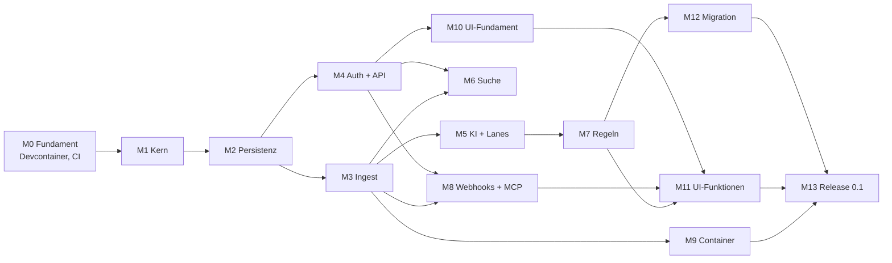

# Papiq – Umsetzungsplan

Stand: 06.10.2026 · Grundlage: [architektur.md](architektur.md)

Papiq wird API-first in 14 Meilensteinen (M0–M13) gebaut. Ab M3 lassen sich Dokumente per API einliefern; ab M11 ist Papiq über die Web-UI vollständig nutzbar; M13 schließt mit Release 0.1 und den ersten 100 Dokumenten ab.

## Abhängigkeiten

## Übersicht

| Kürzel | Meilenstein | Modell | Effort |
| --- | --- | --- | --- |
| M0 | Fundament: Devcontainer, CI, Konfiguration | Sonnet 5.5 | high |
| M1 | Domänenkern und Ports | Opus 5.5 | high |
| M2 | Persistenz (SQLite, Postgres), Jobs, Outbox | Opus 5.5 | medium |
| M3 | Ingest-Pipeline: Speicher, OCR, Parsing, Worker, SSE | Opus 5.5 | high |
| M4 | Authentifizierung, Rechte, REST-API | Opus 5.5 | high (+ Review Fable 5.1 · high) |
| M5 | KI-Klassifizierung, Konfidenz, Lanes, Posteingang | Opus 5.5 | high |
| M6 | Suche mit Meilisearch | Sonnet 5.5 | high |
| M7 | Regel-Engine | Opus 5.5 | high |
| M8 | Webhooks und MCP-Server | Sonnet 5.5 | high |
| M9 | Papiq-Image mit s6-overlay | Sonnet 5.5 | high |
| M10 | Web-UI-Fundament und Design | Opus 5.5 | high |
| M11 | Web-UI-Funktionen | Sonnet 5.5 | medium (Regel-Baukasten: Opus 5.5 · high) |
| M12 | Migration aus Paperless-ngx | Sonnet 5.5 | high |
| M13 | Härtung und Release 0.1 | Fable 5.1 | high |

**Faustregel für die Modellwahl**

- **Opus 5.5** für alles, was Struktur festlegt oder schwer zu korrigieren ist: Kern, Datenmodell, Nebenläufigkeit, Sicherheit, Regel-Logik, Design-System.
- **Sonnet 5.5** für klar umrissene Integrationen nach festem Muster: Adapter, Container, Webhooks, Bildschirme nach Vorlage.
- **Fable 5.1** für unabhängige Prüfungen und lange, verifikationslastige Abschnitte (Sicherheits-Review, Release-Härtung).
- **Effort:** `medium` bei klarem Umfang, `high`, wenn Verifikation zählt (Default bei den meisten Modellen; Opus 5.5 startet bei `medium`). `xhigh`/`max` nur gezielt für einzelne harte Probleme, z. B. per `ultrathink` im Prompt. ([Quelle](https://code.claude.com/docs/en/model-config))
- Jeder Meilenstein beginnt mit einem Plan (Plan-Modus) und endet mit einem Review durch einen separaten Agenten, der die Umsetzung nicht geschrieben hat.

## Meilensteine

### M0 – Fundament: Devcontainer, CI, Konfiguration

**Ziel:** Entwickeln und Testen vollständig im Devcontainer; alle Abhängigkeiten starten mit.

- Devcontainer wie im Abschnitt [Devcontainer](#devcontainer) beschrieben.
- Mehrstufiges `Dockerfile` mit Ziel `dev` (Devcontainer) und `runtime` (M9), damit Entwicklung und Betrieb dieselben Systempakete nutzen.
- Konfiguration: `PAPIQ_`-Variablen mit Pydantic Settings, `_FILE`-Variablen für Docker Secrets, Abbruch bei ungültiger Konfiguration.
- Composition Root als Gerüst; strukturiertes Logging.
- CI: Lint, Typen, Import-Verträge, Tests; Testmatrix SQLite/Postgres vorbereitet.

**Fertig, wenn:** „Reopen in Container" startet Postgres, Garage und Meilisearch; `uv run pytest` läuft im Container grün; CI ist grün.

**Modell:** Sonnet 5.5 · high – viel bekanntes Muster, aber die Garage-Initialisierung und Netzwerk-Details brauchen Verifikation.

### M1 – Domänenkern und Ports

**Ziel:** Fachlogik ohne jede Technik, vollständig testbar.

- Entitäten: Nutzer, Rolle, Dokument, Kontakt, Dokumenttyp, Tag, Attribut-Definition und -Wert, Schublade, Freigabe, Lane, Verarbeitungsschritt.
- Rechteprüfung (Besitzer, Schublade, Freigabe lesen/schreiben).
- Zustandsautomat der Pipeline und Lane-Berechnung (schlechtestes Schrittergebnis).
- Ports mit echten async Signaturen; In-Memory-Adapter für jeden Port; Vertragstest-Suiten.

**Vorher klären:** Attribut-Datentypen.

**Fertig, wenn:** Kern-Tests decken Rechte, Zustandsautomat und Lanes ab; Import-Verträge grün.

**Modell:** Opus 5.5 · high – legt die Struktur fest, auf der alles aufbaut.

### M2 – Persistenz, Jobs, Outbox

**Ziel:** Repository-, Job-Queue- und Event-Bus-Adapter auf SQLite und Postgres.

- SQLAlchemy 2 async (aiosqlite, asyncpg), Alembic-Migrationen für beide Datenbanken.
- Job-Tabelle mit Retries, Sperren und Idempotenz.
- Outbox-Tabelle, Verteilung im Prozess; Polling (SQLite) und optional `LISTEN/NOTIFY` (Postgres).

**Fertig, wenn:** Vertragstests aus M1 laufen gegen SQLite und Postgres grün.

**Modell:** Opus 5.5 · medium – klarer Umfang, aber zwei Datenbanken und Nebenläufigkeit.

### M3 – Ingest-Pipeline

**Ziel:** Ein Dokument per API einliefern und bis „Parsen" verarbeiten.

- Objektspeicher-Adapter: Dateisystem und S3 (Garage); SHA-256 als Schlüssel, Dublettenprüfung.
- `POST /documents` mit `202 Accepted`; Worker-Dienst; Schritte Empfangen → OCR → Parsen mit Retries.
- OCRmyPDF- und Docling-Adapter, rechenlastig in eigenen Prozessen.
- Verarbeitungsprotokoll je Schritt; „Schritt wiederholen", „ab Schritt X neu verarbeiten".
- Server-Sent Events für Fortschritt.

**Fertig, wenn:** Ein PDF und ein Foto laufen durch, Archiv-PDF und Docling-Ausgabe liegen im Speicher, ein abgebrochener Schritt lässt sich einzeln wiederholen.

**Modell:** Opus 5.5 · high – Idempotenz, Prozesse und Fehlerpfade.

### M4 – Authentifizierung, Rechte, REST-API

**Ziel:** Mehrbenutzerbetrieb und vollständige API für Stammdaten und Schubladen.

- Nativer Login (Argon2id), TOTP optional, Session-Cookie, persönliche API-Tokens mit Stufen.
- OIDC über Authlib, Verknüpfung mit lokalem Konto.
- Endpunkte: Nutzer (Admin), Stammdaten (Admin), Schubladen und Freigaben, Dokumente; OpenAPI-Spezifikation sauber gepflegt.

**Fertig, wenn:** Rechte-Tests zeigen, dass kein Nutzer fremde Dokumente ohne Freigabe sieht; OpenAPI ist vollständig.

**Modell:** Opus 5.5 · high; danach Sicherheits-Review mit Fable 5.1 · high – sicherheitskritisch, unabhängige Prüfung lohnt.

### M5 – KI-Klassifizierung, Konfidenz, Lanes

**Ziel:** Dokumente werden klassifiziert und landen in Grün, Gelb oder Rot.

- LLM- und Embedding-Adapter (OpenAI-kompatibel), strukturierte Ausgabe mit festem Schema.
- Klassifizierung (Kontakt, Typ, Tags), Attribut-Extraktion je Dokumenttyp.
- Konfidenz aus prüfbaren Fakten (Abgleich, Liste, Wert im Text); neue Gegebenheiten → Gelb.
- Posteingang (API): gelbe und rote Dokumente nur für den Besitzer.
- Kleiner Bewertungssatz aus Beispieldokumenten, um Modelle vergleichen zu können.

**Vorher klären:** LLM und Embedding-Modell, Konfidenz-Schwellen, Anzahl Retries.

**Fertig, wenn:** Der Bewertungssatz läuft reproduzierbar; Lanes stimmen mit den Erwartungen überein.

**Modell:** Opus 5.5 · high – Prompt- und Schema-Design, Bewertung.

### M6 – Suche

**Ziel:** Hybride Suche, gefiltert nach Rechten.

- Meilisearch-Adapter, Index-Aktualisierung per Ereignis, vollständiger Neuaufbau per Job.
- Jede Suche gefiltert auf sichtbare Schubladen.

**Fertig, wenn:** Rechte-Tests für die Suche grün; Neuaufbau aus Datenbank und Speicher funktioniert.

**Modell:** Sonnet 5.5 · high – bekannte Integration, der Rechtefilter braucht Sorgfalt.

### M7 – Regel-Engine

**Ziel:** Globale und Nutzer-Regeln wie spezifiziert.

- Bedingungsbaum, Operatoren, Aktionen, Priorität, Konflikte → Gelb (auch Regel gegen LLM).
- Versionierung, Protokoll, Probelauf bei Dokumentänderungen.
- Rückwirkendes Anwenden: Ermittlung der betroffenen Dokumente und Ausführung als Job (Auswahl in der UI folgt in M11).

**Fertig, wenn:** Tests decken Konflikte, Schleifenschutz und Rechtegrenzen globaler Regeln ab.

**Modell:** Opus 5.5 · high – viele Randfälle, Wechselwirkung mit Rechten.

### M8 – Webhooks und MCP-Server

**Ziel:** Externe Systeme informieren und Claude anbinden.

- Webhook-Abonnements pro Nutzer, schlanke Ereignisse, HMAC-SHA256, Retries, Zustellprotokoll.
- MCP-Server über HTTP mit API-Token: `search`, `get_document`, `get_text`, `update_metadata`, `list_tags`.

**Fertig, wenn:** Ein Test-Empfänger erhält signierte Ereignisse; ein lokaler MCP-Client kann suchen und Metadaten ändern.

**Modell:** Sonnet 5.5 · high.

### M9 – Papiq-Image mit s6-overlay

**Ziel:** Ein betriebsfertiges Image.

- `runtime`-Ziel im Dockerfile: Debian slim, OCRmyPDF-Abhängigkeiten, Docling mit PyTorch (CPU).
- s6-Dienste: `init-papiq`, `init-migrations`, `svc-api`, `svc-worker`; `PAPIQ_ROLE`, `PUID`/`PGID`, Healthchecks.
- Beispiel-Compose für SQLite + Dateisystem und für Postgres + Garage.
- CI baut Images für amd64 und arm64.

**Vorher klären:** Backup-Strategie.

**Fertig, wenn:** Beide Beispiel-Stacks starten, migrieren und verarbeiten ein Dokument.

**Modell:** Sonnet 5.5 · high.

### M10 – Web-UI-Fundament

**Ziel:** Cleanes, modernes Grundgerüst, auf dem alle Bildschirme aufbauen.

- SvelteKit (statisch), Tailwind, shadcn-svelte; TypeScript-Client aus OpenAPI generiert.
- Gestaltungsrichtung, Farben, Typografie, Dark Mode; Login inkl. TOTP; Navigation.

**Fertig, wenn:** Login funktioniert, Design-System steht, Uvicorn liefert die gebaute UI aus.

**Modell:** Opus 5.5 · high – Gestaltungsentscheidungen prägen die ganze UI.

### M11 – Web-UI-Funktionen

**Ziel:** Papiq vollständig über die Oberfläche nutzbar.

- Dokumentliste und -detail mit PDF.js, Upload, Fortschritt per SSE.
- Posteingang mit Lanes, Bestätigen und Korrigieren.
- Schubladen und Freigaben, Stammdaten (Admin), Webhooks, API-Tokens, Einstellungen.
- Regel-Baukasten mit Probelauf und Auswahldialog für rückwirkendes Anwenden.

**Fertig, wenn:** Alle Abläufe aus dem Architektur-Dokument sind in der UI erreichbar.

**Modell:** Sonnet 5.5 · medium für Bildschirme nach Vorlage; Regel-Baukasten mit Opus 5.5 · high.

### M12 – Migration aus Paperless-ngx

**Ziel:** Bestehendes Paperless-Archiv übernehmen, nur über die Papiq-API.

- CLI liest die Paperless-REST-API, schreibt über die Papiq-API.
- Abbildung von Korrespondenten, Typen, Tags, Custom Fields, Besitzern; Speicherpfade und Berechtigungen auf Schubladen.
- Probelauf mit Bericht, dann Übernahme; wiederaufnehmbar.

**Vorher klären:** Abbildung von Speicherpfaden und Berechtigungen.

**Fertig, wenn:** Eine Paperless-Testinstanz ist vollständig übernommen, der Bericht zeigt keine Verluste.

**Modell:** Sonnet 5.5 · high.

### M13 – Härtung und Release 0.1

**Ziel:** Papiq mit den ersten 100 Dokumenten produktiv nutzen.

- Ende-zu-Ende-Lauf mit 100 Dokumenten; Auswertung der Lanes.
- Sicherheits- und Architektur-Review des Gesamtsystems.
- Dokumentation: Installation, Konfiguration (alle `PAPIQ_`-Variablen), Backup.

**Vorher klären:** Verfügbarkeit des Namens.

**Fertig, wenn:** Review-Befunde sind behoben, Release 0.1 ist getaggt.

**Modell:** Fable 5.1 · high – lange, verifikationslastige Prüfung über das ganze System.

## Devcontainer

Entwickelt und getestet wird im Devcontainer; er startet alle Abhängigkeiten per Docker Compose mit.

**Dienste** (`.devcontainer/compose.yml`)

| Dienst | Zweck |
| --- | --- |
| `dev` | Arbeitsumgebung: Ziel `dev` aus dem Papiq-Dockerfile, also dieselben Systempakete wie im Betrieb (Tesseract mit Deutsch und Englisch, Ghostscript u. a.); dazu Python 3.13 mit uv, Node.js mit pnpm |
| `postgres` | Datenbank für Postgres-Tests |
| `garage` | S3-Speicher; ein Init-Schritt legt Layout, Schlüssel und Bucket an |
| `meilisearch` | Suche |

**Weitere Punkte**

- Funktion „Docker outside of Docker", damit sich aus dem Devcontainer das Papiq-Image bauen und starten lässt (M9).
- Weitergeleitete Ports: API, Vite-Entwicklungsserver, Meilisearch, Garage.
- Nach dem Erstellen: `uv sync` und `pnpm install` automatisch.
- Tests: Kern-Tests mit In-Memory-Adaptern; Vertragstests gegen SQLite, Postgres, Dateisystem, Garage und Meilisearch aus dem Compose-Netz.
- LLM: kein Modell im Devcontainer. Tests nutzen einen Fake-Adapter; für echte Läufe zeigt `PAPIQ_LLM_BASE_URL` auf ein vorhandenes Ollama (z. B. auf dem Host über `host.docker.internal`). Docker auf macOS hat keinen GPU-Zugriff, ein Ollama im Container wäre dort langsam.
- Alle Images müssen amd64 und arm64 unterstützen.
- Versionen der Abhängigkeiten werden gepinnt.
